# File: combined_doc.md


# File: DBDesign.md

# Data Base Design 
## Design steps 
- Requirement Analysis 

what is the need for the data base, user needs 
- Conceptual Design  

ERD, high level design
- Logical Design 

translate the high level design into data model
- Physical Design

 indexes, disl layouts
- Security Design: 

authentication, security  


## Level of abstractiosn Data Model 
- ### User View 
what the user see when querying the data base
- ### Conceptual Schema
defines the logical structure of the data base
- ### Physical Schema
describes the files and indexes of the data base 
s
## Data Independence
isolate apps from the structure of the data base. 
### Logical Data Independence: 
Maintains the same views when the logical structure of the data base changes.
### Physical Data Independence:
Maintains the Logical Structure when the physical structure of the data base changes. 

we need to make sure that the data base is independent from the application. because the environment that incubates the database is changing.


<b> 
Integrity constraints can be reared to business rules.
</b>

# ER Model 

- **Entity**: real world object described by set of attributes. 
- **Entity set**: collection of entities that share the same attributes. 
- **Relationship**: relationship between two entity sets.
- **Weak entity**: can be identified in term of another entity.


# File: DDBs.md

# Intro to Big Data 

Data varies in forms there is structured data which we can put in a tabular form. unstructured which is not structured like documents, files, videos, voices. semi structured like xml, json. 

some forms of big data: data collected from space, genome code.
Big Data sources: phones, social media, sensors, Health Care devices.
 

Big data is characterized by those characteristic: 
- **Volume:** the size of the data. 
- **Velocity:** the speed generation of the data. 
- **Variety:** heterogenous sources and the nature of the data.
- **Verosity:** guarantees of  the data. 
- **Value:** the value it's provide. 

### Why traditional DBMS does not works at that scale? 


## Data Properities 
- Raw: the rawer the data the more valueable it is. 
- Immutable: events once happens it's a fact, it is not change. no updates is permitted updating value require to create a new record with the new values keeping the old value the same.
    - human fault-tolerance you can rollback from faults easly, more storage, processing. 
    - scarifce mutating data makes concurrencey control not used.
- Eternal: a piece of data, once true, always be true.


# File: DDIA.md

# System load and performance


## Profiling  


# File: FilesAndDisks.md

# Memory and Disks 
## Database Architecture 
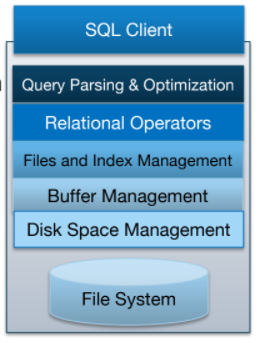  


# Memory Hirarchy 
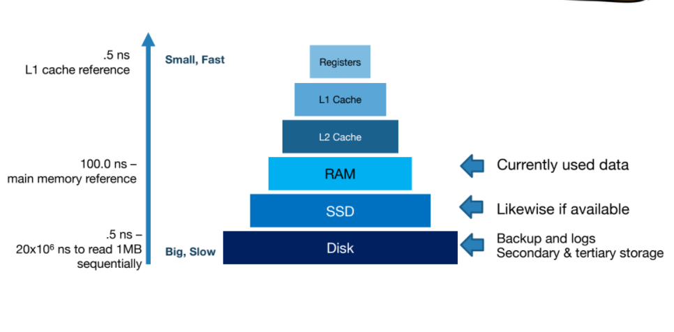 

## Two Types of Disks 
- ### Hard Drive Disk 
- ### Solid State Disk 

## Block Level Storage
- Read and write large chunks of data sequnetially. 
- maximize use of data 
    - cache popularly used data in memory.
    - pre-fetch data likely to be accessed data. 
    - Buffer write to sequential blocks.
- Block is a unit of transfer data between disk and memory.
- page when in RAM. Block when in disk. 

## Disk Space Management 
- manage space on Disks, map pages to locations on disk. 
- load pages from disk to memory. 
- save pages again to disk.
- read/write, allocate/deallocate logical pages. 
- implementation 
    -  talk to storage devise directly.
    - run our own over file system


# Memory Vs Disks 
 - whenever a database process data is must be stored in memory. accessing data from memory is fast. 
 - Large data can not be fit in memory, disks used to cheaply stroe data. but with large cost when read or write. 

## Files, Pages, Records 
- the basic unit of data in relational database is a **record(row)**, records organized into **relations(tables)**. 
- the basic unit of storage for disk is a **page**, smallest unit of transfer data between disk and memory. 
- to store it on disk each relation is stored in a file, and each record organized in a pages in the file. 
- database determine type of file, how pages are organized in this file, how records organized into each page, format of record.  

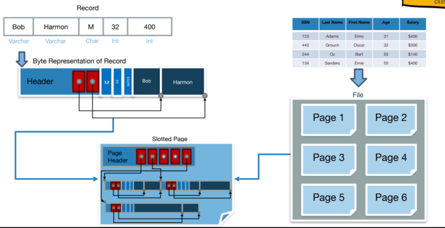

## Types of Files 
- database descide which based on I/O cost of the relation accses pattern. 1 page write/read disk.
## Heap files:  
- ## Linked list Implementation
    - every data page contains records, pointers to next and previous page, free space tracker. 
    - Header page act as a header for the linked list. sperate the data pages int two linked list. full pages and free pages. 
    - when space is not enough, a new page is allocated, and append to the free portion, when page become full moves to full pages. 
    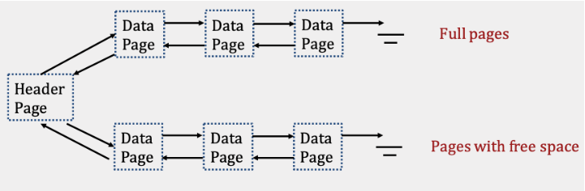 
- ## Page Dictionary implementation
    - Linked list for header page, each header point to the header page, it's entries contain pointers to data page and the amount of free data.
    - page directory is faster than linked list, but it is more complex to implement. 
    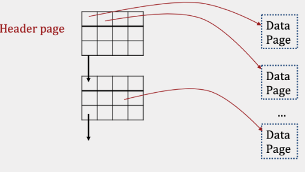


## Sorted Files: 
- sorted files pages are ordered and records ordered by keys.
- searching is O(Log(n)) n = num of pages
- heap organization faster than sorted in insersion, sorted faster in search. 

## Records Types: 
- Fixed Length: contain fixed length fields(Integer, boolean, date), each record conatains same num of bytes. 
- Variable Length: contain variabl/fixed length fields, each record conatains different num of bytes. fixed stored first then variables, with record header points to the end of the variable length field.  
- every record identified by a unique **record id(rid)**. 

## Page Format: 
- ## Pages with fixed Length records. 
    - use page header storing num of records currently on the page. 
    - when there is no gapes between pages the, when insert calculate the next position using num of records and it's size. 
    - when there is gap the header page stares a additional bitmap indicates which slots are open to taken. when insert find the first slot and insert the record, set the bit to filled.  
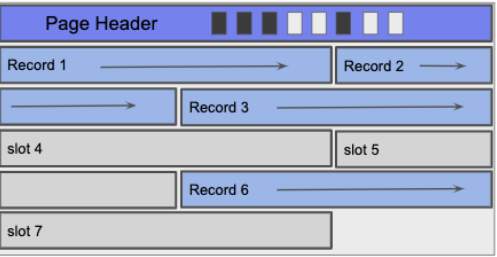

- ## Pages with variables length records. 
    - each page uses page footer maintains the slot directory tracking slot count, a free space pointer, entries.    
    - slot count track the number of slots in the page, filled and empty. free space pointer points to the next free position whithin the page, each entry contain [record pointer, record length]. 
    - when delete, find record entry setting [RP, RL] to null. 
    - when insert, find first free slot, set  entery [RP, RL] to the record. when there is no null create new entry. 

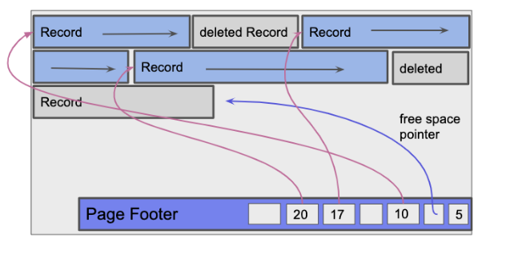 
</br> 

## Cost Model   
- Analysis of the cost of different operations in a database. 
- it depends on 
    - B: number of blocks in the database.   
    - R: number of records in the Block. 
    - D: average time for R/W disk block.

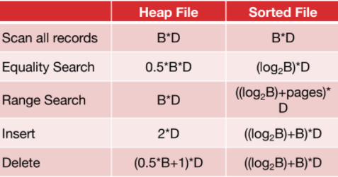

# Row Vs Column oriented database
two styles by which databases stores there tables on disk
## Row Store 
- optimal for OLTP => On Line Transactional Proccessing 
- 
## Column Store 
- tables are stored as columns in disk, column by column beside each other any IO gives the complete column. 
- less IOs required to get more values of the given column, more when working with multible columns.
- OLAP > OnLineAnalyticalProccessing 
- Writes are slower that makes it suitable for OLAP, Compress effecient because it can have duplicates, amazinng for aggreation, bad with multi columns quries. 
# Indexing
- looking up things by values.
> “If you don't find it in the index, look very carefully through the entire catalog. 
- Indexing Data Structure 
    - Search Trees(AVL, B+ Tree, Red Black Tree, 2-3 Tree) 
    - Hash Table 

## Index 
- index is a data structure that enables quick **lookup(equality)** and **modification(insert, delete)** of **data entries(items stored in index)** by search **key(subset of columns)**.   
- **Types** B+ trees, B- trees, Hash Tables, GIST.


# Database Engines
library that takes care of the on disk storage and crud
- mysql gives you the choice to choose which engine to use PG does not. 


# File: IndexingAndBuffers.md

# Indexing and B+ Trees  


# Indexing
- looking up things by values.
> “If you don't find it in the index, look very carefully through the entire catalog. 
- Indexing Data Structure 
    - Search Trees(AVL, B+ Tree, Red Black Tree, 2-3 Tree) 
    - Hash Table 

## Index 
- index is a data structure that enables quick **lookup(equality)** and **modification(insert, delete)** of **data entries(items stored in index)** by search **key(subset of columns)**.   
- **Types** B+ trees, B- trees, Hash Tables, GIST, allow lookups without scanning all data.


## Indexing 
- index is a data structure that allows you speed up reads on a speicific key. it's make queries run faster especially those that are run frequently. 
- index on the user id is a good example of an index. 


## Primary Key Vs Secondary key
- the primary key is about clusetering the heap about this key and we have to maintain order. called **Index Organized Table** in oracle. 
- The secondary Key is a pointer to row on the disk it's not ordered.
- in postgres there is no more than secondary index. 


## Bloom Filters 
- it's an in memory data structure that represents the absents/presents of a value in the database. 


## B+ Trees 
- B+ tree have very high **Fan-out**: number of pointers to child nodes in a node. 
- B+ tree is a **self-balancing** tree, grows at root not leaves.
- strores data entries in **leaf nodes** only, thus called B Plus Tree. 
- **Order** is the number of children nodes for internal nodes. it's measure capacity of a nodes.  
- the number of entries for each internal node must satisfy **d < entries < 2d**.  
- Max fan-out is **2d + 1** == num of pointers.  
- Only the leaf nodes contain records (or pointers to records).  Th einner nodes (which are the non-leaf nodes) do not contain the actual records just the keys.

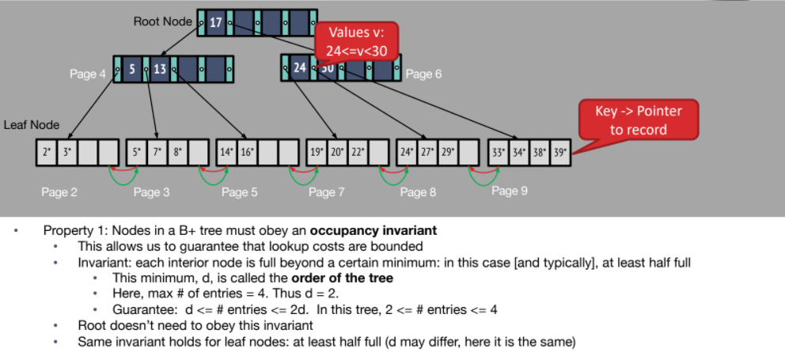 

## Scalling B+ Trees 
- B+ tree allow index Massive number of records.
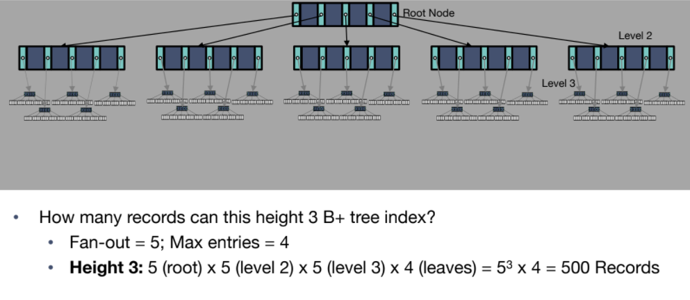


### Searching B+ Trees
- start at root, do a binary search on the key, find the record in the leafs.
 

## inseting B+ Trees 
- find the correct Leaf.
- put data entry int the leaf. 
    - if leaf have enough space, insert, done!. 
    - else split the leaf into two leafs. (L1, L2)  
        - redistribute the entries evenly, **copy up** middle key and ptr to L2. 
        -  insert index entry pointing to L2 into L.  
            - else recursively split and **push up** from parents.  

### Before Inserting B+ Trees
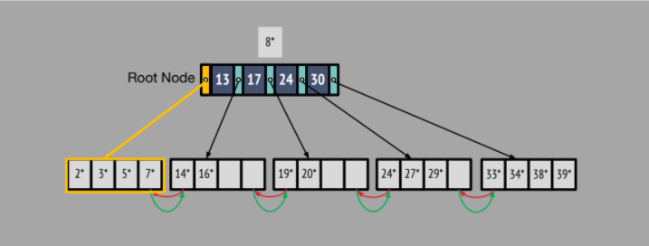 


### After Inserting B+ Trees
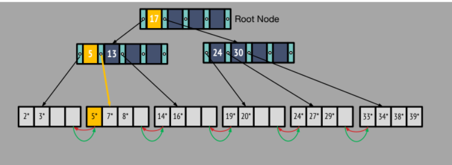


## Deleting B+ Trees 
- occupency invariants not inforced during deletion. 
- just delete leaf entries and save space for next insertion.  
-  if leaf is completely empty, taht's ok 


## B+ Tree Bulk Loading 
- Build index on Large table from scratch. it will take a long time, search from root and insert leaving half empty Leaves. modify random pages. 
- **Smarter Way** Sort input records by key, fill leaf page by fill factor 3/4. 
-  when parent is full split.  

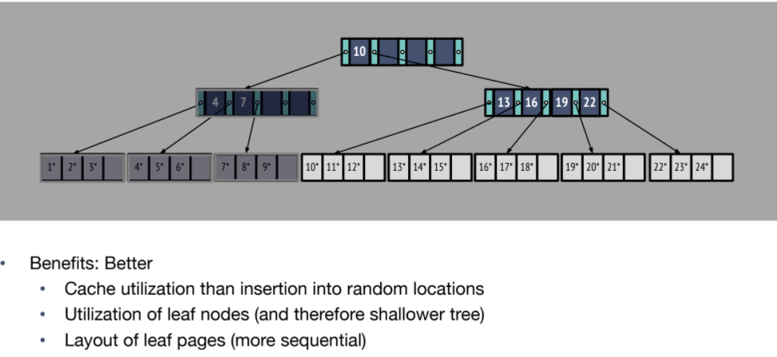  


# Summary

- B+ Tree is a powerful dynamic indexing structure
- Inserts/deletes leave tree height-balanced; logFN cost
- High fanout (F) means height rarely more than 3 or 4.
- Higher levels stay in cache, avoiding expensive disk I/O
- Almost always better than maintaining a sorted file.
- Widely used in DBMSs!
- Bulk loading can be much faster than repeated inserts for creating a B+ tree on a large
data set.


# Refinmets on indices 
- issues to consider in any index Structure.
    - Query Support: types of queries that can be performed on an index.  
    - choice of search key 
    - Data Entry Storage. 
    - Variable length keys.
    - Cost of index. 

## Query Support
- Basic Selections: in single dimension 
    - equality 
    - range
- Exotic Selections: in multi-dimension 
    - 2d Box/Circle/Polygon
    - 3d R-tree/K-d Tree 
    - nearest neighbor queries
    - Reqular Expressions, Genome Strings.
    - geo-spatial queries. 

## Search Key and Ordering 
- in an orederd index, the keys is orderd lexicographically. by the search key, order 1st column, if ==, then order 2nd column, and so on.
- Search by rang using Composite Key. 

## Data Entry Storage
- the repersentation of data entry in index, actual data Or Reference to data. 
- Three types of data entry in index: 
    - **Value**: record data stored in the index file. 
    - **Reference**: index contains key and record id<PID, RId>. 
    - **List of Reference**: Key and a list of matching records ids. 
- indexing by reference required to support multible indexes per table.


## Clustered and Non-Clustered Indexes
* ### Clustered Indexes 
    - sort the haep file, leave some space on each block for future inserts. 
    - index entries direct search to data entries.
    - gives fairly sequential access to data in the haep file. 
    - **faster for rang queries.** 
    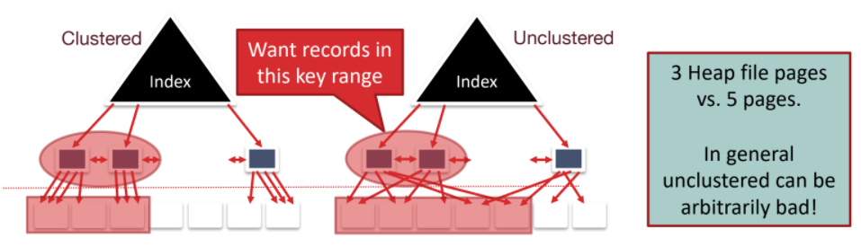
    - **Order of data records is “close to”, but not identical to, the sort order.** 
    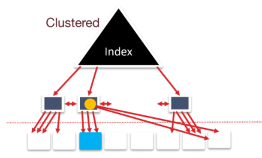 


## Clustered Indexes vs Non-Clustered Indexes
- ### clustered Pros 
    - efficient for range queries. 
    - potential locality benfits, faster for sequential access and prefetching. 
    - support certain types of comperissions.  
- ### clustered cons 
    - more expensive to maintains, periodically update heap order, resort, reclustered heap file incrementally. 
    - heap file usually only packed 2/3 to accomodate new data, leaving space for future inserting. 


## Variable Length Keys  
- fill factor is the number of bytes.
- compress prefix/suffix of key to save space. 

## B+ tree cost Model  
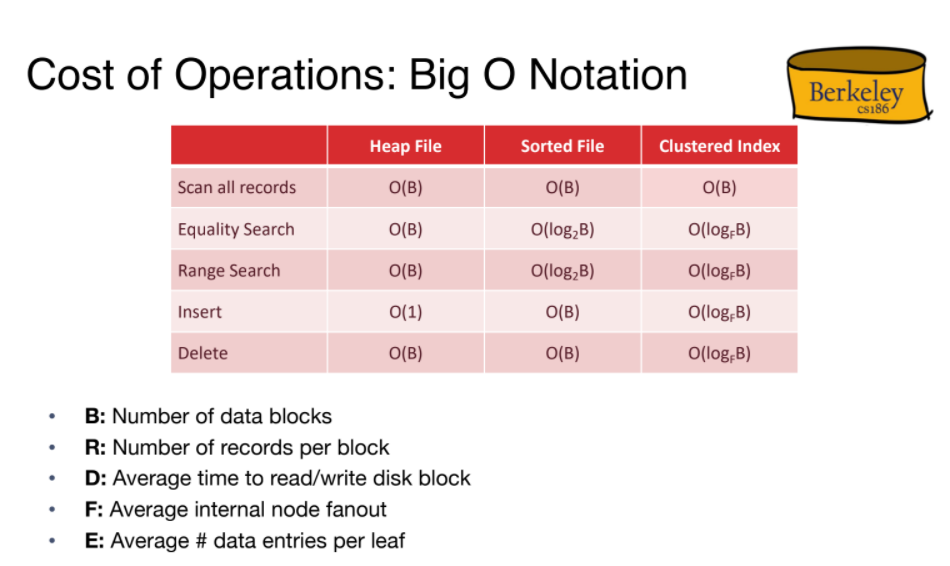


# Buffer Managment

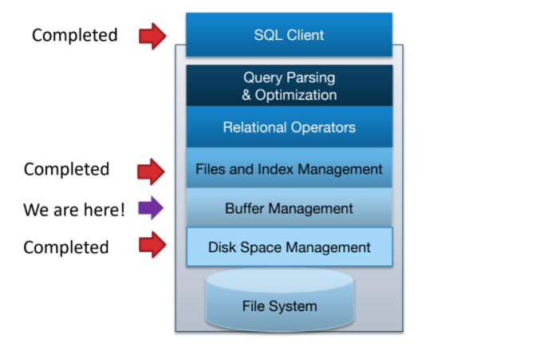
## Buffer Manager 
- buffer manager is responsible for managing pages in memory **(the buffer pool)** and recvives page requests from the file and index manager. eviction/addition of pages is done by the buffer manager with communication with the disk space manager.

## Buffer Pool
- memory is converted into a buffer pool by partioning the spaces int **Frames** that **Pages** can placed in. pages fit perfectly in frames. 

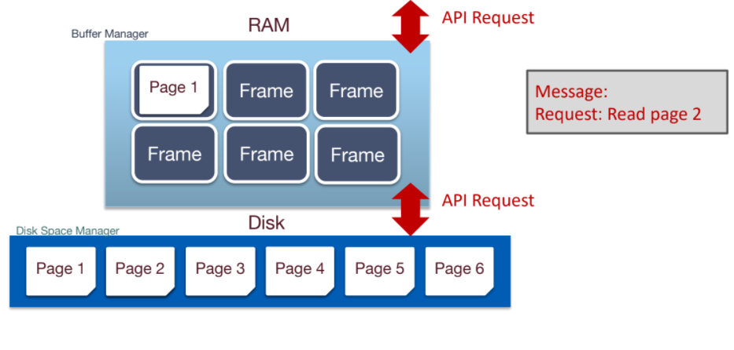
- to effectively manage the buffer pool, buffer manager allocates additional space into memory for metadata the table contains.
    - **Frame Id**: each frame has a unique id associated with a memory address. 
    - **Page Id**: associated with Frame id, determines which frame contains tha page.
    - **Dirty Bit**: Y/N verifying whether or not page has modified. 
    - **Pin Bit**: 1/0 tracking number of requestors currentely using the page.

- concurrent operations are supported by concurrency control. 
- System Crash solved by recovery control.

## Handling Page Requests
- if requested page in the 
    - the page **pin count** is incremented and the page memory address is returned. 
- if requested page is not in the buffer pool 
    - if buffer pool is not full. 
        - request page from disk space manager add to buffer pool **pin count** incremented, and memory address returned to user. 
    - if buffer pool is full. 
        - **Replacement policy** used to determine which page to evict. 
        - choice of replacement policy depends on page access pattern counting number of **pages hit** (page in memory). 
        - if the evicted page is dirty, it is written to disk to ensure that updates are persisted.

## LRU Replacement Policy
- Pinned frames not evicted.
- track time each frame was last used, store column in metadata, replace the min, unpinned to replace.
- Good for frequently accessed pages(temporal locality).
- costly for fin the min(priority queue) another alternative is **Clock**.
- LRU Perform poorly when set of pages accessed multiple time repeatedly causing **sequntial flooding** 0 hits.
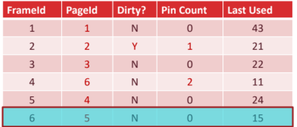


## Clock Replacement Policy
- treats frames as a circular list of frames. 
- clock hand point to the next page to consider. 
- ref bit approximate recenty refernced pages.
- if current pin count > 0, move clock hand to next page.
- if current pin count = 0, and ref bit = 1, clear ref bit and skip. 
- if current pin count = 0, and ref bit = 0. 
    - replace 
    - set pin to 1.
    - set ref bit to 1.
    - advance clock hand.
    - return pointer to page.

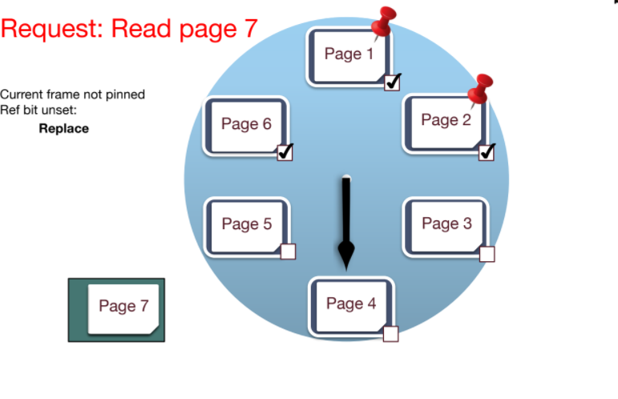 

 
## Most Recently Used Replacement Policy
- instead of evicting the least recently used page, evict the most recently used page. 
- it's commonly used for sequential scanning.
- improve sequential scanning by prefetch. 
- prefetching amortize random I/O overhead for disk. 
- allow computation to continue while disk is busy.


# File: PartioningAndSharding.md

# Partitioning 
is a teqenique where you split a huge table into mutltibles parts and let db decides which table to hit based on the where clause. you partitioning on a partion key. 

## Horizontal Vs Vertical 
- **Horizontal** Splits rows in partion in a specific range 
- **Vertical** splits columns int partitions which you can use to store a large column(Blob) in it's own tablespace. 

## Partioning Types 
- By Range: partition in dates range, ids
- By List: Discrete Values, any rows that have a specific calue goes to one partition. 
- By Hash: using hash fuction to spread out the tables. 


## HP Vs Sharding 
- ### Sharding:
    - splits big tables into multiple parts across multiple database servers. 
    - the table stays the same but server changes.  
    - deciding is based on the client some IPs goes to shards in specific location.

- ### HP: 
    - splits big into multiples parts int the same database server. 
    - table name changes, name, schema...

## Partitioning Pros
- increase query performance when accessing single partition
- easy bulk loading(attach partitions) 
- archive old data that barely accessed.

## Partitioning Cons
- updates that moves data from one patition to another will move the entire table to another. 
- may you scan all partitions with infeccient qury.
- schema changing is challenging.


# Sharding
is the process of segmentin the data into partitions that are spread on multiples database instances based on the hashed value of a partition key/shard key. 

## Consistent Hashing
it's teknique that take some value and hash it based on a hash func to detrmine which server to locate this row. 

## Sharding Pros & Cons 
- ### Pros 
    - data and memory can be scalable instead of put all the data on a single machine. 
    - Security you can restrict access for specific shards and increase the security levl. 
- ### Cons 
    - clients should be aware which shard to hit 
    - TXNs across multiple shards
    - Rollbacks is hard.
    - schema changes is hard. 
    - joins is hard. 
    - 


# File: postgresql.md


## CLI 
- Creating database 
```SQL
CREATE DATABASE database_name
```
- connecting to database 
```shell
psql database 
psql -h localhost -p 5432 -U elaraby databsename 
``` 


## Regular Commands 
- `\l` : list all databases 
- `\c database_name` : connect to database
- `\dt` : list all tables in database
- `\d table_name` : list all columns in table
- `d` stands for describe 
- `\i file_name` : run sql file
## Notes 
- `bigserial` is a data type that is a combination of serial and bigint, it's an auto incrementing integer that can hold a very large number. 
- use mockaroo to generate fake data. export as .sql file and run it in psql. 


## Views 
- is a subset of database based on a query from one or more tables. saved in the database as named query 'virtual table' and can be used frequently.
- 


# File: practical.md

## Create table with milions of rows

```sql 
CREATE Table temp (t int);

-- the generate series create series of integer based on the start and end
-- the Random func return fraction 
Insert Into temp(t) SELECT  Random() * 100 from generate_series(0, 1000000);

```

## Indexing in Postgres
<!-- - every primary key has an index by default 
- decide if we should use the index or seq scanning is called **planning time** -->
```sql 
-- to explain the query you wanna do 
-- this query will runs very fast because it will make use of the index as it select the from the index file directly
EXPLAIN ANALYZE select id from empolyess where id = 1000;  

-- this query will runs slower than previous one because it will go to the heap to retrive the page that includes the desired row.
-- if i make the same query again it will be faster because the page is cahced in the buffer.
EXPLAIN analyze select name from employess where id = 2000;

-- this is the slower quey amongs the three queries because it have no index it will do seq scan on the table to find this value. 
-- PostGRES do smart work by running multiple threads to make query faster.
-- query on string matching is the worst it will do extra works to matching. 
EXPALIN ANALYZE select id from employess where name = "Zs";


-- CREATE Index on name
CREATE INDEX employess_name on employees(name);


-- doing the prev query will be tremindious fast because it will make Bitmap index scan
-- you can not quey the index on expression it is not a single value so the index will not be used, makes parallel seq scan
```

## EXPLAIN EXPLAIN In POSTGRES 
- gives info about quey plan postgres will use to a given query.
- explain can be better of  select count when retiveing the nums of rows
- Information 
    - width: is the sum of all the bytes in the row 
    - rows: nums of rows fetched.
    
## Index scan vs Index only scan 
- Create index create B+ Tree index 
- **index scan** mean you used the index to find the predicate and go to the heap to featch the page that contain this value. 
- **index only scan** use the value that reside in the index itself without going to the disk.

## key Vs Non key column indexs
- key is what we search, the non key it what we fetch from the index it's included in the index. 
- take care of the index size. the more the size of index the more of pages you search. 
- if you select two columns and they are indexed the one on the predicate that will be used to fetch the other from disk. 
- you should create indexes based on your queries. 
- the larger your table the better your non-key indeices.
```sql 
-- we pull all the name column in the index so it have'nt goes to the disk.
create index id_idx on grades(id) include (name);

```


## Composite Index 
- use multicolumn index if you quey on multicolumns condition

## How database decides to uses indexes
- it use table statistics to decides

##  Seq Vs Index Scan Vs Bitmap scan 
-  

## Create index concurently 
- it's allows you to write and read while creating an index.

```sql 
create index concurrently g  on grades(g);
```

## Working with Billions row table. 
- using multible conccurent threads search at the same time. 
- using index can increase the speed significantly. 
- **Partioning** the table horizontally on a **Partion Key** that will detrmine which part to search in. that will decrease the amount of data to search in.
- **Partioning and Sharding** 


## Working with partitions in postgres
- partioning key can not have null values. 


```Sql 
Create table grades_org ( 
    id serial not null, 
    g int not null
)


insert into grades_g(g) select floor(Random() * 100) from generate_series (0, 1000000); 

create index grades_org_index on grades_org(g);

-- partitioning 
-- this will create the partitions table with partitioning in mind
Create table grades_parts ( 
    id serial not null, 
    g int not null
) partition by range(g); -- create prations based on g


-- define parts  this will create tables with range from 0 to 35 the same schema as grades_parts including it's indexes
create table grades_0035 (like grades_parts including indexes)

-- attach partitions on my major tables each with it's range
 alter table grades_parts attach partition grades_0035 for values from range (0) to (35) 

-- copy all values from grades_org to grades_parts 
insert into grades_parts select * from  grades_org;

select max(g) from grades parts; -- will return 99 
select max(g) from grades_0035; --will return 34; 

-- creating index on the leader partititon will create index on all it's parts 
create index gades_parts_idx on grades_parts(g); 

-- select values from grades parts will send the query to it's proper partition
select count(*) from grades_parts where g = 30; -- goes to partition 0035 

-- knowing tables siazes
select pg_relation_size(oid), relname from pg_class order by pg_relation_size(oid);

-- enable partition pruning will search the partition that have the values only 

``` 

# Connection Pooling 

# Cursor 
is a kind of loopes that can be used tor traverse the rows returened from a query. it's commonly used to loop throught large set of results. 
Cursors can only be used in stored procedures, functions and triggers to loop through the results of a query one row at a time. 
cursor properities
- read-only they can be used to view data not to update it. 
- not-scrollable: they show the results in a sequntial manner, not showing the rows in a different order than the one returned from the query or to skip the rows to a specific row.  

### Pros and Cons 
#### Pros 
- saves memory: you do not with all the data at once, you insted works it slowely and allocate memory as you go. 
- streaming: you can pulls rows and stream them int any type of conecction. 
- can be canceled whenever you want.

#### Cons
- stateful: there is a memory allocated for it in the database, and TXN point to it. 
- long running transaction: can stop other users from using the database, sto DDL ops. 


## Client Vs server cusrsor
client side you create a cursor on the client and connect to the database and excute the query and the results are excuted and deliverd over the network to your client. 

server side you create a cursor ont the database, and when you need something client can fetch as it wants. results excuted and sits on the server and waiting to be fetched. 
```sql 
begin 
-- declare the cursor and assing memory for it
declare c cursor for select id from student where grade between 100 and 90; 
-- fetch data 
fetch c; -- return the first row
fetch c; -- return the next row
fetch c; -- return the next row
fetch last c; -- return the last row
``` 

# Database Security


# File: QueryAndParallelproccessing.md

# iterators and joins 

## Relational operators and Query plans  
- relational algebra expressions is a query plan in form of a tree, edges represents flow of tuples from one node to another, nodes are relational ops. 
- every input to a relational op is a relation, and every output is a relation, called **data flow graph**. 
- query optimizer selects operators to run, query exuter runs this operators by creating instances of operators. 
- each operator instance implements iterator interface to excute operator logic and forwording tiples to the next operator.


## Iterators interface 
- setup -> configuring the input args 
- init -> setup the operator state 
- next -> iterate over the input tuples and return output tuple 
- close -> clean up the operator state. 
- init and next can result in streaming(on-the-fly), or blocking(batch) alogrithm for iterator. 
- **streaming** constant amount of work for every call 
- **blocking** does not return until all the work is done consume its entire input.  
- iterator maintain a private state. 

### Select operator iterator
```ruby 
def init(predicate) 
    child.init() 
    pred = predicate 
    curr = null 
end 
def  next() 
    while (curr != EOF && !pred(curr)) 
        curr = child.next()
    end   
    return curr 
end 

def close() 
    child.close() 
end 
```

### Heap scan operator iterator 
```ruby  
    def init(relation) 
        heap = relation.get_heap() 
        curr_page = heap.get_first_page()
        curr_slot = curr_page.get_first_slot()
    end 

    def next() 
        return EOF if curr_page == null  
        curr = [curr_page, curr_slot] 
        curr_slot = curr_page.get_next_slot() 
        if(curr_slot == null) 
            curr_page = curr_page.get_next_page() 
            if(curr_page == null) return EOF 
            curr_slot = curr_page.get_first_slot() 
        end 
        return curr
    end 

    def close() 
        heap.close() 
    end
``` 

### Sort Iterator 
```ruby 
    def init(keys) 
        child.init()
        run = [] 
        for child in childs 
            ren << child.sort(keys)
        end
        load into buffer
    end 

    def next() 
        output = run.min 
        if runn of min is empty?
            fetch next page from disk to buffer 
        end 
        return output
    end

    def close()  
        deallocate runs files
        child.close() 
    end
```

### Group by Iterator 
```ruby 
def init(keys, aggs) 
    child.init() 
    curr_group = null 
end

def next() 
    until result    
        result = null 
        tup = child.next()
        if(group(tup) != curr_group) 
            if(curr_group != null) 
                result = [curr_group, final().all]  
            end
            curr_group = group(tup)
            init()
        end 
        merge(tup)
    end 
    return result
end 

def close() 
    child.close() 
end     
```


## Join Algorithms
# R, S
### Nested loop join 
- for each record r in R 
    - for each record s in S 
        - if join condition(r, s) 
            - add(r, s) to buffer 

- **cost**: number of records in R + [number of records in R * number of records in S] 
- scan R once + scan S once per R tuples
- joins order matters. 


### page nested loop join
- for each rpage in R  
    - for each spage in S 
        - for each rrecord in R 
            - for each srecord in S 
                - if join condition(rrecord, srecord) 
                    - add(rrecord, srecord) to buffer 

- scan R once and and scan S per page of R
- better than nested loop join, but still not optimal. 

### Block nested loop join
 - scan R once + scan S as many times as there are blocks in R


### Index nested loop join 
- optimizer selects index join if it is found an index on both relations.
- when we have index on S that is on the appropriate key, we can use index nested loop join. 
- for each record r in R 
    - for each record s in S 
        - if join condition(ri, si) 
            - add(r, s) to buffer   

### Sort merge join
- requires equality predicate on both relations. 
**Algorithm**: 
- sort R and S by join conidtion, all equals key are consecutive. 
**Cost**: 
- sort then join -> sort R + sort S + [R]+[S] 
- we can do refinement of sort merge join by combining last pass of merge-sort and join pass.
```ruby 
do  
    if(!mark) 
        while(s > r) { advance r} 
        while(r > s) { advance s} 
        mark = s 
    end  

    if(s == r) 
        result = [r, s] 
        advance s
        return result
    else 
        reset to mark 
        advance r
        mark = null
    end
end 
```

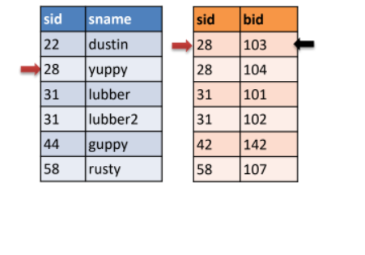

## Hash join
- ### Two passes  
    - ### Partitioning 
        - partition tuples fromm R and S by join key and store them in scratch disk. 
    
    - ### Build & Probe 
        - build hash table on R and probe hash table on S. 

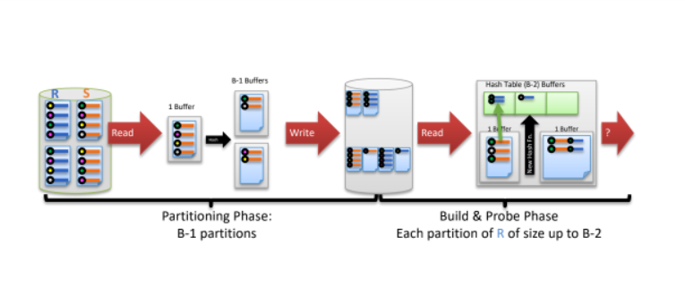

### Cost
Partitioning phase: read+write both relations
⇒ 2([R]+[S]) I/Os
• Matching phase: read both relations, forward output
⇒ [R]+[S]
• Total cost of 2-pass hash join = 3([R]+[S])
• 3 * (1000 + 500) = 4500 


# Parallel Query Processing 

## parallelism
- parallelism is all about I/O bandwidth, it's all about how much data throught the pipes of your systems at once. 
- scan 1 tera-byte is a big deal! you can take a big problem and break it down into smaller pieces. each piece can be processed in parallel. each piece is independent of each other.  
- ### two metrics 
    - speed-up when adding more hardware.
    - scale-up when adding more hardware and size of data grows up.

- ### kinds of parallelism
    - **Pipelining** multible stages of nested functions(operators) runs in parallel. operator run produce output and pass it to the next operator to run upon it in parallel.
    - **Partitioning** partitions data across multiple machines, each machine can run the query at the same time. partioning and parallelism scales up to the amount of data.

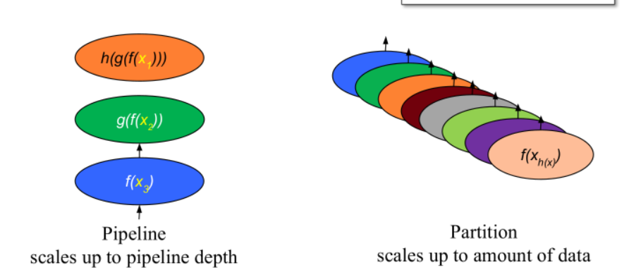 

## Parallel Architectures

### Shared Memory 
- typical to regular cpomputers 
### Shared Disk 
- sperate cpu and memory sharing the same disk.
### Shared Nothing
- each node has its own memory and cpu and disk that are connected by network.  
- shared nothing is the most common,scales with data, does't rely on hardware.
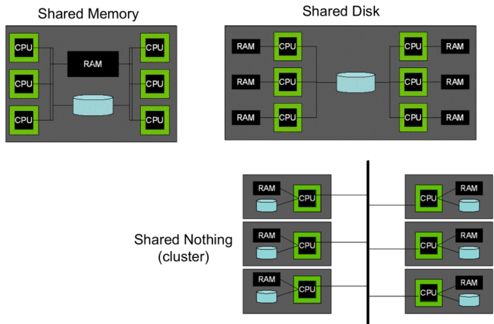


## Query Parallelism
### Inter-Query 
- parallelism across queries. multiple queries can run in parallel on a seprate processor, single thread per query. 
- require parallel aware concurrency control when doing updates on disk.
### Intra-Query
- **Inter-operator-pipelining**parallelism within a query. multiple queries can runs in parallel within the same query.
- **Inter-operator-pushy** parallelism within a query, query divdied int multible parts and doing it's computation materialized the output of part and jpin the all parts together. 
- **Intra-operator** divide the query on multiple machines and run it on each machine in parallel. 

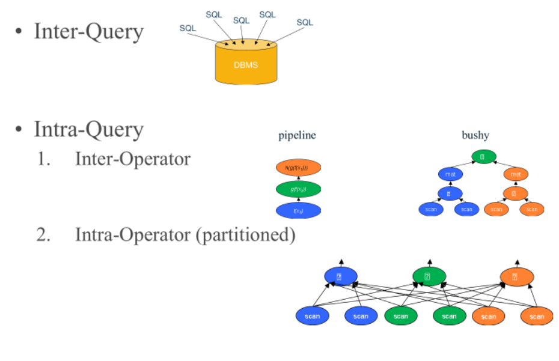 


## Data Partitioning
partitioning is the process of dividing data into multiple parts and distributing them to multiple machines.
### Round Robin

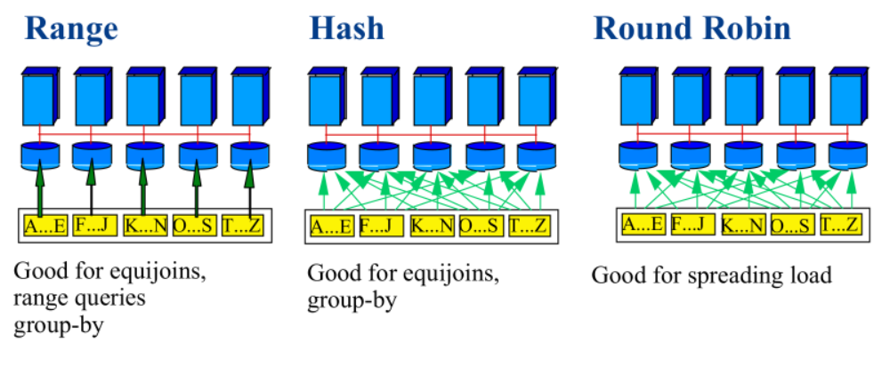

## Parallel Query

### parallel Scan 
- sacn in parallel find matches on every machine, concat the result when it is done merge it on some machine.
- if the partitioning is on the slection key we can skip entire machine that does not have the key.
- index can be built at each partitioning.
- lookup by Key 
    - if partioning on the key go to the relevent node 
    - else brodcast lookup to all nodes 
- insert 
    - if partitioning on the key go to the relevent node and insert 
    - else insert anywhere
- insert unique key 
    - if partitioning on the key go to the relevent node and reject if already exist. 
    - else brodcast lookup check if not exist insert else reject. 


## parallel hashing 
Phase 1: shuffle data across machines (hn)

- streaming out to network as it is scanned
which machine for this record?
use (yet another) independent hash function hn

- Receivers proceed with phase 1 in a pipeline
as data streams in from local disk
and network 

## Pallel hash join
- Phase 1: shuffle data across machines (hn) 
- Pass 2 is local Grace Hash Join per node

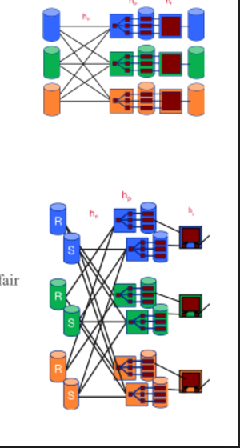


## Parallel Sort  
- Phase 1: shuffle data across machines on specific ranges
- Phase 2: sort data on each machine 

## parallel Sort Merge Join 
- Phase 1: shuffle data across machines on specific ranges. 
- Phase 2: sort data on each machine.
- merge join partitions locally on each machine. 
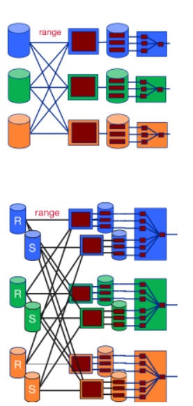 


## Parallel Aggregation
- Hierarchical Aggregation
- for each aggregate function we need global and local ggregation.**Sum(Sum(x))**


## Symmetric Hash join 
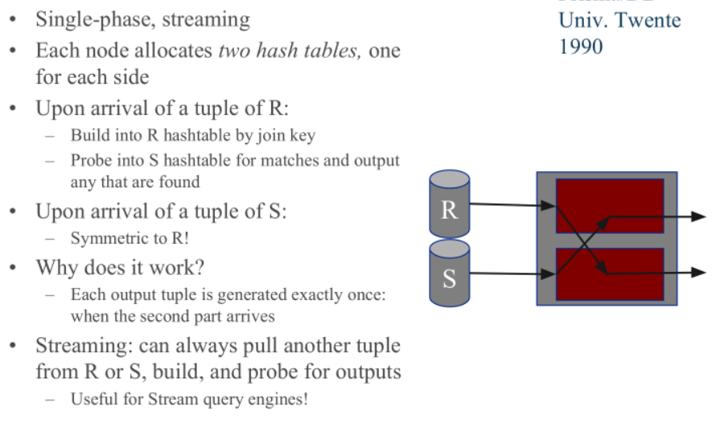 


## Brodcast join 
- if one of two relations is small, we can broadcat it to all nodes that have a partition of S. 
- do local join on each node and union the result. 

## Parallel DBMS Summary

- ## Parallelism natural to query processing:
- Both pipeline and partition
- ## Shared-Nothing vs. Shared-Mem vs. Shared Disk
- Shared-mem easiest SW, costliest HW.
- Doesn’t scale.
- Shared-nothing cheap, scales well, harder to implement.
- Shared disk a middle ground
- Introduces icky stuff related to concurrency control
- ## Intra-op, Inter-op, & Inter-query parallelism all possible.

- ## Data layout choices important!
- ## Most DB operations can be done partition-parallel
- Sort.
- Sort-merge join, hash-join.
- ## Complex plans.
- Allow for pipeline-parallelism, but sorts, hashes block
- the pipeline.
- Partition parallelism achieved via bushy trees.
- ## Transactions actually pretty easy
- distributed deadlock detection
- two-phase commit
- ## 2PC not great for availability, latency
- single failure stalls the whole system
- transaction commit waits for the slowest worker


# File: QueryOptimization.md

# Query Parsing & Optimization 

## Query optimizer  
- the bridge between a declartive domain specific language **SQL** and custom imparative computer program 
- take Query what you want and descide how to compute this query 
- in terms of today technology this is AI-driven Software Synthis. 
- similiar to AI today try to find the best best result in a large search space Heuristic and Optimization. 
- Research today try to use Deep RL to improve the pruning of QO
- invented long time ago as part of System R.


## Query parsing and Optimization
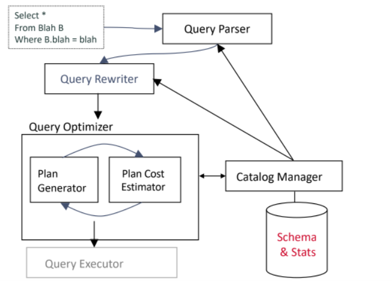 

## Query Parser
- parse the query into a synatcs tree structure
- check for correctness of the query
- check of authorization is the user has the right to equery that table.

## Query Rewriter 
- flatten views 
- convert subqueries into joins or to fewer query blocks.
- convert the query into form as simple as posible. 

## Cost based Query Optimizer 
- optimize one query block at a time. 
- use catalog stats to find the least-cost plan per query block.

## Query Optimizer 
- Query block converted into relational algebra 
- relational algebra converted into tree 
- each operatore has implementaion choices e.g joins algorithms. 
- operators can be applied in diffrent orders. 
- ### Component of Query Optimizer 
    - plan space: all possible plans for a query.
    - cost: cost of each plan. 
    - search strategy: how to find the best plan.
- ### Goals 
    - find the the plan with least estimated cost, and try to avoid really bad actual plans.

## Relational Algebra Equivalence
- to rewrite a relational algebra expression into another you need a set of equevilance rules. 
- cascade, commutative. 
- ### Join Ordering 
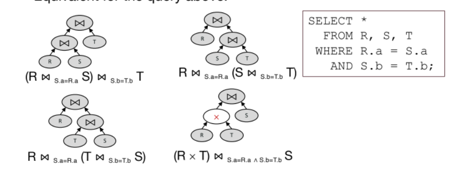   

### Common Heuristics 
- ### Selections
    - Apply selection as soon as you have the relevent columns. 
    - select first and join then with smaller input. 
- ### Projections
    - keep only the columns you need to evaluate downstream operators. 
- ### Avoid cross products
    - use theta join when possible avoid cross products.


## Phsical Equivalence
- ### Base table access
    - Heap scan
    - Index scan (if available on referenced columns)
- ### Equijoins
    - Block (Chunk) Nested Loop: simple, exploits extra memory
    - Index Nested Loop: often good if 1 rel small and the other indexed properly
    - Sort-Merge Join: good with small memory, equal-size tables
    - Grace/Hybrid Hash Join: even better than sort with 1 small table
- ### Non-Equijoins
    - Block (Chunk) Nested Loop

## Plan Cost Analysis 
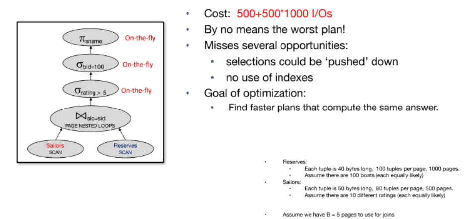

- ### Slection pushdown 
    - push down rating > 5 to left side of join. minimize the cost to the half.  
    - push down bid = 100 to right does not change the cost because it dones on the fly.
    - materialize the right side of the join minimize the cost. 
- ### Join Ordering 
    - move the inner join to the left side of the join minimize the cost if the relation size is smaller.
    - change the ordering and materialize the right side of the join.
- ### Join Algorithms 
    - changing the join algorithm can change the cost.
- ### Projection pushdown 
    - pushing down projection to the left side of the join. 
- ### Indexes 
    - indexs clustered or not.


# Costing and Searching 

## What we need to do Query Optimization? 
given a closed set of operators relatinal operators that takes table in and table out. 
this operators has logical equivilance(cascade, commute) and phsical equivelnce(types of algo). 
### plan space
given this set of operators we have plan space which all the possible query plans that produce the same correct answer. this plans defined by the relationsl equivelence and physical equievelnce.

### Cost Estimation
what is the cost of our operators. and estimation to the size of data that goes into this operators. 
the size of data is based on the catalog info whta is size of the table.

### Search Algorithm
search algorithms that goes through the search space and find the best plan with the least cost. 

## Big Piecture of System R Optimizer 
**plan space** too big plans must be pruned. if many plans have the same **overpriced** subplan ignore them. avoid cross product. consider only the left deep plans.s
- System R consider only the left joins tree because it restrict the plan space allow us to fully piplined the plans intermidiate results not written.

**cost estimation** 
- stats in system catalog used to estimates the size of data and cost. 
- cinsiders compination of I/O and CPU cost.
**search algorithm** 
- System R uses a Dynamic Programming based search algorithm. 
- **Dynamic Programming**: optimization technique for problems with subcomponents. 

## Query Blocks 
- query blocks are the unit of work that the optimizer works on. you want to brak your query into smaller blocks optimizing one block at atime. 
- flatten your queries blocks into single one query block. query rewriter. 

### physical properties 
- output of an operator Sorted, Hash Grouping. 
- opertors that produce properties in certain form(sorted). index, sort, hash grouping. 
- merge join require inputs to be sorted.
- merge join and nested loop join preserves the sort order of inputs. 

## Cost Estimation
- for each plan must estimate the total cost. 
- estimate the cost of each operators depedns on the cardinalities. and size of the result of each operator. it will be input to the next operator.
- in system R the cost is boiled down to **#IO + CPU-factor*#tuples**.

### Statistics and Catalog 
- catalog contains the statistics of the tables. 
- updated periodically.
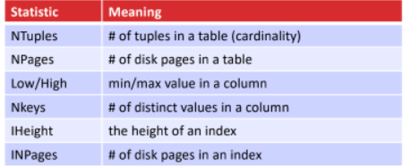 

### Selectivity 
- reflects the impact of the query in reducing the number of tuples returned.
- sel = |output| / |input|.
- result of size estimation. 

### Slectivity With Histograms
- the idea is divide the input into buckets of equla values and count the number of tuples in each bucket. 
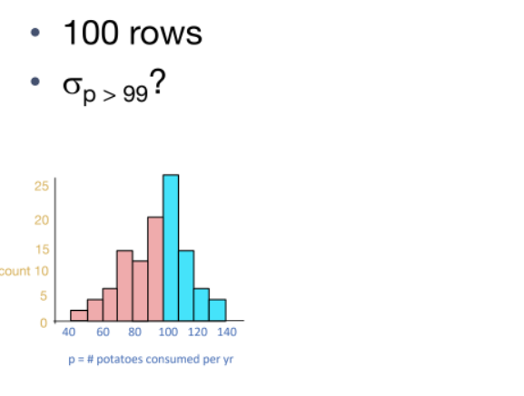 

**Selectivity Conjunction**
- multiply of sleectivity of each conjuct.
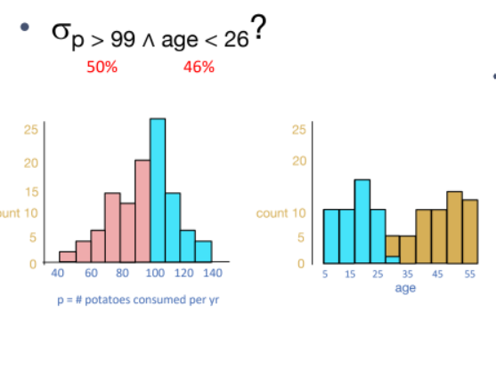 

**Selectivity Disjunction**
- sum of sleectivity of each disjunct - multiply of two disjunct.  
- 50% + 46% - (50% × 46%) = 73% 

**Selectivity Not** 
- 1 - sel.

### Join Selectivity
- Simply compute the selectivity of all predicates
- And multiply by the product of the table sizes


## Search Algorithm

### Single table plans
- single table quries includes select, project, and agg. 
- consider each access path file scan, index scan, and sort.
- choose the one with the least cost.
- slection, projection, done on the fly.
- result pipliend into grouping/aggregation. 

### Cost Estimation for Single Table Plans with index 
- clusterd index featch adjacent pages contains index indecies are adjacent. 
- non-clustered index all pages that may be contains index.
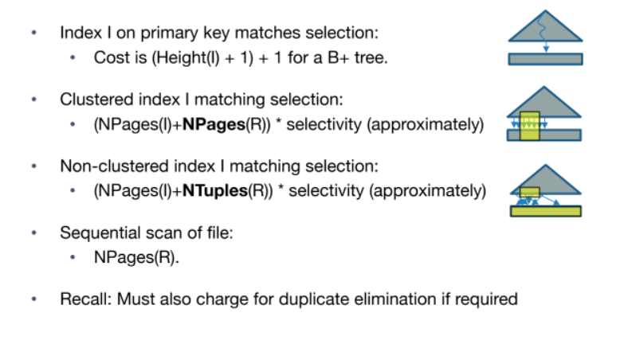


## Dynamic Programming


# File: Recovery.md

# Recovery 
Recovery manager is in charge of atomicity and durability of the data. It is responsible for ensuring that data is not lost in the event of a system failure. and rollback of Xact that violates consistency.

if a transaction is aborted, the recovery manager will rollback the changes made by the aborted transaction. 

## Why Xact is abort? 
**application** can abort Xact if there is a problem with the data. exception handled. 
**Failed consistency**: integrity constraint violation. delete a row that is referenced by another row.
**Deadlock**: abort Xact that conflict other Xact. 
**System failure**: system crash. power failure. 

## Transaction and SQL

### Savepoints 
- release savepoint: release all the changes made after the savepoint. 
- rollback to savepoint: rollback all the changes made after the savepoint. 

## DataBase Crash
- operator errors: type wrong command, plug out the power. 
- connection errors: insufficent resources disk space. file permissions. 
- software errors: bug in the code.  
- Hardware errors: disk failure. server hardware failure. 

## Buffer Manager 
- **No STEAL Policy**: do not allow buffer-pool frame with uncommited updates to be replaced. 
- **FORCE Policy**: make sure that every update is enforced to disk before commit. 

The prefered policy is **STEAL/NO-FORCE**.

## Write Ahead Log 
every update is written to the log disk to allow REDO/UNDO. multiple updates written to single log page.
A log is a sequence of log records that describethe operations that the database has done. 
- Log record contains:
    - <TXID, pageID, old data, new data> 

### Policy 
- write to log before write to disk. **UNDO**
- write all the log records to the log before commit. **REDO** 
**UNDO**: guranatee atomicity.
**REDO**: guranatee durability.

## The Log  
an orderd file with a write buffer in ram. each log record has a unique log sequence number**LSN**. and **flushdLSN** that indicate the number of log record flushed to memory. and **PageLSN** pointer on disk that point to the last log record for an update to that page.

## Undo Logging
undo Xact that have not been committed. uses the force and steal policy. 
- **STEAL** if Xact modified X, then <T,X,N> must be written to log disk before commit.
- **FORCE** if Xact commit then dirty page must be written to disk before commit.

**Example**: 
if Xact modified X, then flushed to disk and crashed before commit it will be undo.
if Xact commit then flushed to disk and crashed after commit nothing to do. data written to disk.

## REDO Logging 
at recovery time, REDO the Txns that have been committed. and leave the uncommitted Txns. 
- **No-STEAL**: if Xact modified X, then <T,X,N> must be written to log disk before before dirty pages written to disk. 

**Example**: 
if Xact modified X, then committed and the system crash Redo the Txn. 
if Xact modified X, and crached before committing do nothing. 


# File: SortingAndHashing.md

# Sorting and Hashing
9.1, 13.1, 13.3, 13.4.2

## Sorting

### Why sort?
- **Rendezvous**: getting together tupels that need to be proccessed together in memory at the same time. 
    - **Distinct**: remove duplicates, group duplctaes together and keep just ine of them as a representative.
    - **Grouping for suumerizing**: group members of a group together and compute a summary of the group.
    - **Join Algorithms**: merge sort join, need to rendezvous tuples from two different tables and concatenate them.
- **Ordering**: 
    - the user ask to sort the data in a specific order.
    - Bulk Loding the first step in indexing. 

## out-of-core Algorithms
- algorithms that are not in-core(in ram memory).

## Single-pass Algorithms
**Map**
- compute f(x) for each record, write out to the result.
- 

**Approach**:
- read a chunk from input to input buffer.
- write f(x) for each record, compress it in some manner, write to output buffer.
- when the input buffer is empty, read another chunk from input.
- when the output buffer is full, write it to output.

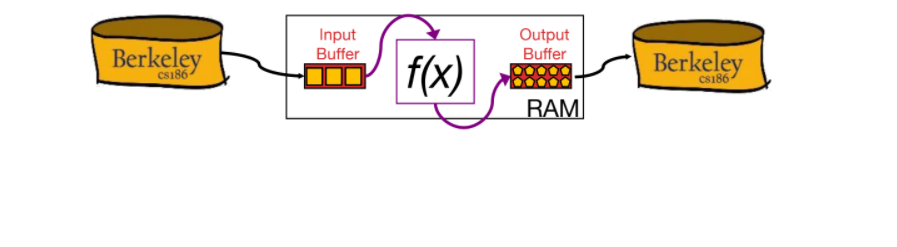
one thread doing I/O and Computation.
## Double Buffer Algorithms
- Two Threads: Main thread run f(x) on one pair I/O buffer, I/O thread drain/fill unused buffers. 
- parallelism: two operations are running at the same time(Overlappin). 
- parallelism: happen on disk, it's a parallel device.
- I/O handling deserve it's own thread, it's a general theme in desining I/O intensive systems like database systems.
- two threads are swapping buffers between them when every thread finish their current task.

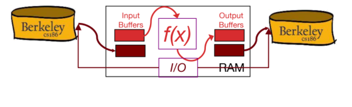


## Sorting & Hashing formal specification
- ### Sorting
    - A File F produce an output file Fs with content R stored in order by given criteria. 
- ### Hashing
    - A File F produce an output file Fh with content R arranged on disk that two records that have the same key are stored consecutively, no two same records sperated by a record with differnt hash value.


## I/O 
in Database systems we only care about # of I/O operations. because of how time consuming it is to read and write to disk. when developing an algorithm, we need to think about how much I/O operations it will take and minimize the # of I/O it will incure.

## Sorting 
## Two Way sorting
- pass 0 (conquer a batch) 
    - read a page sort it write to the disk, now having one page size sorted in disk. 
    - only one buffer is used.
    - a repeated "batch job"  
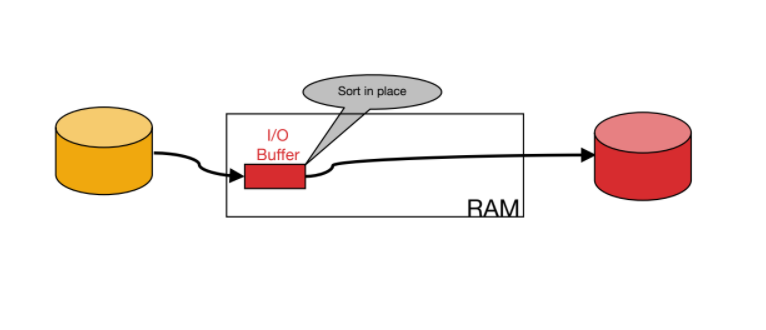
- pass 1,2,3,...(mege via streaming)
    - require 3 buffer pages. 
    - read tow sorted blocks that generated by pass 0, take smallest buffer from input buffer write it in output buffer(merging). 
    - keep doing until Output buffer is full, write it to memory.
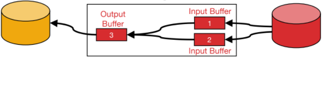

**Cost Model**: 
**2N * (1 + (log2 N)) I/Os** 

## General External Merge Sort
- the result of merging two sorted merges called **sorted run**
- tow optimization 
    - **ONE**rather than sort individual pages, load B pages and sort them all at once. 
    - **SECOND** merge more than sorted runs at a time. 
- the conquring phase produce (N/B).ceil sorted runs. 
- during the merging we are dividing number of sorted runs by B-1, so the base of our log is b-1.
- number of pages in each sorted run 0 is B, in pass 1 = B * B-1

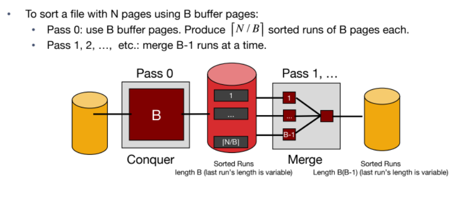
## anlayzing the algorithm
- every pass require 2 * N I/O operations. where N is the number of pages, read in every page and write it after modification.
- you always need one pass for the first pass 0. 
- **Passes** 1 + (logb-1 N/B).ceil
- **I/Os** 2N * (1 + (logb-1 N/B).ceil  
- **Minimum num of buffer pages need to to sort N pages in X passes** **N/B(B-1) <= X**


# Hashing 
## External Hashing
sometimes ypu need to group together the same values, and remove duplicates.
in databases grouping together the same values is called **Hashing**. 
we can not doing hashing in memory, we need to do it out-of-core.

## Hashing Algorithm
Because we can not fit all of the data in memory at once we need to build several hash tables and concatenate them together. and we need to guarantee that each value has the same hash value grouped together in memory.

### Divide and Conquer 
- Divide: 
    - partitioning passes, hash each record to B-1 partitions, every partition have similar hash values. 
    - when output buffer is full, write it to disk and insure taht all pages from this partion are adjacents. 
    - if the partition is bigger than B, we partition it again using differnt hash function, we can do that recursively.
- Conquer: 
    - constructing hash tables. 

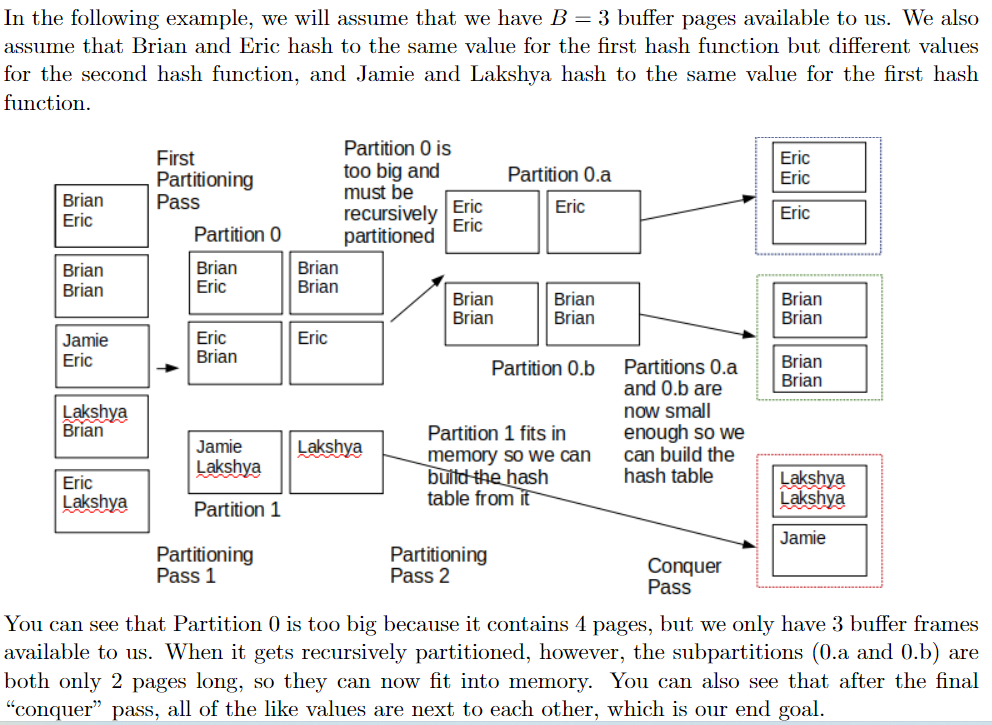


## Cost of External Hashing
- 4N I/Os 

## Sorting Vs Hashing
- Sorting is conquer and divide, Hashing is divide and conquer. 
- sorting is **4N** I/Os, Hashing is **~4N** I/Os. where N is the number of pages.


## Parallel Hashing 
- **phase 1**: shuffles data across the machines using hash function hn to determines which machine for this record. 
- **phase 2**: recivers procced with phase 1 as a data stream and do external hashing. 

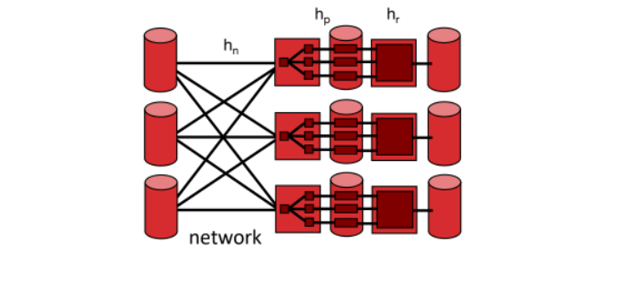

## Parallel Sorting
- **Phase 1**: shuffle data across the machines, split data in ranges every machine has a range od sorted pages. 
- **Phase 2**: recivers procced with phase 1 as a data stream and do external sorting.
- avoid data skewed. 
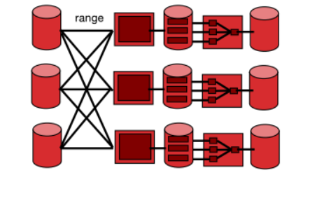

## Sort vs Hashing
- ## sorting 
    - output is sorted.
    - allow duplicate values.
    - scales linearly with the number of input records. 
    - **Cons**: skewed data
- ## Hashing 
    - output is not sorted.
    - no duplicate values.
    - scales linearly with number of duplicates values.  
    - shuffle eqully across machines.


# Relational Algebra
## Relational Algebra
- parser parse SQL query to relational algebra, relational alegebra can be expressed as tree of operators called**logical query plan**. 
- **logical query plan** is a strategey for excuting query expressed as a tree of operators. 

**SQL** is a declarative language, it is a language that describes the data in a database. 
**Relational Algebra** operational description of a computation.

**DBMS** internally transform SQL query into relational algebra, and then execute the relational algebra expresssion, manupilate and siplify it, and figure out the best mechanism to execute it.

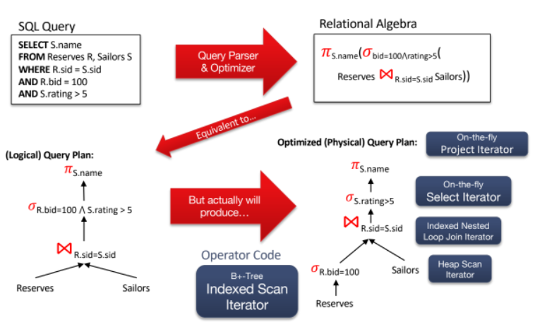


## Relational Algebra Preliminaries
**Closed** results is also a reltion instance.
**Typed** input schema determine the type of the output schema. 
**Set Semantics** no duplicates in a relation instance in contrast of SQl.

## Relational Algebra Operators
- ### Unary Operators single relation  
    - **Projection**: select a subset of columns from a relation.
    - **Selection**: select a subset of records from a relation.
    - **Renaming**: rename the columns of a relation.
    - **Aggregation**: aggregate the values of a relation.
- ### Binary Operators two relations 
    - **Union**: union two relations, same num/type of tuples.
    - **Difference**: difference of two relations.
    - **Cross-Product**: cartesian product of two relations.

- ### compound operators
    - **Theta-Join**: join two relations on a logical expression. 
    - **Equi-Join**: theta join with theta beign a conjuction of equality. 
    - **Natural-Join**: equi-join on all matching columns.


# File: SQL.md

# Week 1  

# DataBase 
- relations is tables, rows are records/tuples, columns are attributes/fields, cardinality is the number of rows.
- SQL is a language for querying databases 
- sechema is the description of the data "metadata" 
- instance is a set of data satisfying the schema
- tables is physical data independence.The logical definition of the data remains
unchanged, even when we make changes to the
actual implementation 


## SQL 
 - SQL is Declarative, say what you want to do, not how to do it. 
 - two types of SQL: 
    - DDL: Data Definition Language, create tables, alter tables, drop tables, etc. 
    - DML: Data Manipulation Language, insert, update, delete, etc. 
- RDMS: is responsible for choose the algorthim to implement the SQL. 

## DDL SQL 
- **Primary key:** unique identifier for each record.
    - provide a unique lookup key for each record. 
    - can not have any duplicates. 
    - can be mad of multiple columns.
- **Foreign Key:** reference to another table.  
    - it point to a primary key of the referenced table. 
    - does not need to have the same name as the revernced key.

## Querying language 
  - ## Querying table 
    - From tells what table to query, where tells what the condition to query on and which specific rows to return, select what columns to return. 
    - the order of returned rows is nondeterministic. unless you specify an order by clause. 
 - ## Null Values 
    - Null represents a value that is unknown or missing. 
    - any operation with null is null  
    - x = null , x > 3, x = 1, x + 4 all evaluate to null. 
    - null is falsy, so where is null just Like where is false. 
    - null is short circuited with boolean operators. 
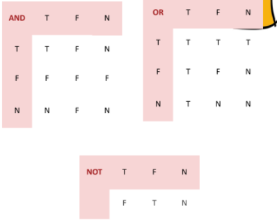 

## Grouping and Aggregation  
- ## Aggregation
    - the input to aggegate fuction is the name of the column, and the output is a single value that is the result of the aggregation. 
    - every aggregate func ignores nulls, except for count(*) which return the overall count of rows. 
 - ## Grpuping  
    - the Group By clause is used to group the rows of a query into groups. and then summenrize each group separately. 
    - the group by  must specified usin Having clause. 
    - the having is similiar to where clause, but it's occur after grouping.  
    - the query bellow excuted as follow 
        - 1- specify the from table person  
        - 2- remove the rows with age < 18 
        - 3- group by age, categorize with groups of the same values. 
        - 4- apply the having clause to remove the groups that don't meet the condition. 
        - 5- every group is collapsed to a single row, returning the specified columns in the select clause, two clouumns one age of the group and average num_dog of the group.  
        - ```sql 
            select age, AVG(num_dogs) 
            from person 
            where age >= 18 
            group by age 
            having count(*) > 1 

    - **if you are going to use grouping or aggregate you must select the only grouped/aggergeated columns**. this is will not work one entire cloumn and one row.  
    - ``` sql 
        select age, avg(num) 
        from person 

        select age, num 
        form person 
        group by age
  
## Order By and Limit 
- by default the order by default is ascending, if you want to sort in descending order you must specify the order by desc.
- the limit clause is used to limit the number of rows returned. 
```sql 
    select name, age
    from person 
    order by age desc, age 
    limit 2
```


## Querying multiple tables  
 - ## Slef join  
    - the self join is a join that is performed on the same table, you can use table aliase join on itself.
    - ```sql 
        SELECT x.sname AS sname1,
            x.age AS age1,
            y.sname AS sname2,
            y.age AS age2
            FROM Sailors AS x, Sailors AS y
            WHERE x.age > y.age 
        );
 - ## Cross join 
    - the simplest way to join two tables is to use a cross join. also known as cross product.  
    - it's the result of combining every row from the left table with every row from the right table. 
    - ```sql 
        select * 
        form student, course   
        where num = c_num
    - the cross product often contains information that is not useful. it's often used to generate a massive amount of data.  
    - you can use the **where** clause to filter the rows that are returned. 

    -  
 - ## Inner Join 
    - the inner join allow you to specify the condition in the on clause. 
    - it's the result of combining rows from the left table with rows from the right table that match on a common column. 
    - ```sql 
        select * 
        form student inner join course 
        on num = c_num
    - the inner join is syntatic sugar of cross join with a join condition in the where clause. 
     
- ## Outer Join 
    - **The left outer join** makes sure that every row from the left table is returned, even if there are no matching rows in the right table. 
    - if a row does not match any row from the right table, the row is still included and the row from the right table filled with null. 
    - ```sql 
        select * 
        form student left outer join course 
        on num = c_num 
    - **the right outer join** is the same as left it returned every row from the right table even if there is not matches, and fill rhe row from the left table with null. 
    - ```sql 
        select * 
        form student right outer join course 
        on num = c_num 
    - **full outer join** it guranatee that every row from the each table will apper in the output. 
    -  if a row from either table does not match any row from the other table, it will still show up in the output and the column form the other table will be filled with null. 
    - ```sql 
        select * 
        form student full outer join course 
        on num = c_num
 - ## Natural Join 
    - sql has the natural join which automatically does equijoin on the columns with same name in diffrent tables. 
    - it's the result of combining rows from the left table with rows from the right table that match on a common column. 
    - ```sql 
        select * 
        form student natural join course 
    - not often used in practice because they are confusing.


 - ## join invariants
    - The different types of joins determine what we do with rows that don’t ever match the “join condition”
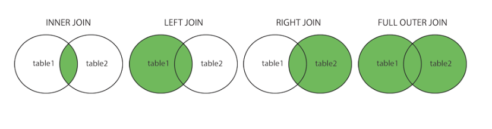

## Naming Conflicts 
- if there is a naming conflict, which occur when two tables have the same column name, the column name will be prefixed with the table name. 
- we should specify which table cloumn we are referring to. 
- ```sql 
    select * 
    form student, course 
    where student.num = course.num  
- 

## Subqueries
 - subquries are used to filter table in acondition. and outer query is used to filter the result of a subquery. 
 - ```sql 
    select num 
    from enrollment 
    where student >= (select avg(tudents) 
                        from enrollment; 
    ); 
- the subquery is not a table, it's a query.  
    - ## Correlated Subqueries 
        - the subquery can also be correlated with the outer query. 
        - ```sql 
            select *  
            from classes  
            where exists (select * 
                            from enrollment 
                            where classes.num = enrollment.num
            ); 
        - exisit is a set operators that return true if any row returned by the subquery and false otherwise. 
        - any, all, union, intersect, except are also set operators. 
    - ## subquries in the from  
        - let you make temporary table to query from. 
        - ```sql 
            select * 
            from (select num 
                    from classes
            ) as temp 
            where num = 1 
    - One thing to note is that subqueries in the FROM cannot usually be correlated withother tables listed in the FROM. 
    - if you want to reuse temporary tables, you must use the common table expression **with clause**. 
    - if you want to use it in another query use VIEW. 

- **ARGMAX**the argmax is a function that returns the row with the maximum value of the specified column. return multiple rows if there are multiple rows with the same maximum value. 

- **VIEWS**: used as a temporary table, to query from it. used instead of subqueries. 
- used as a subroutine to query from another table.
```sql 
CREATE VIEW Redcount AS
SELECT B.bid, COUNT(*) AS scount
FROM Boats B, Reserves R
WHERE R.bid=B.bid AND B.color=‘red’
GROUP BY B.bid;

SELECT * from Redcount WHERE scount<10;
``` 

- **Common Table Expressions**: used to reuse temporary tables. on the fly 
```sql 
    WITH Redcount(bid, scount) AS
        (SELECT B.bid, COUNT (*)
        FROM Boats B, Reserves R
        WHERE R.bid = B.bid AND B.color = 'red'
        GROUP BY B.bid)

        SELECT * FROM Reds
        WHERE scount < 10
```

## SET 
- A UNION B == A OR B, distinct rows from A or B. 
- A INTERSECT B == A AND B, distinct rows from A and B. 
- A EXCEPT B == A BUT NOT B, distinct rows from A and not B. 

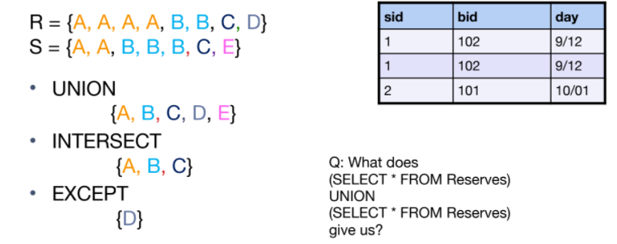


## Multisets 
- can have duplicates values. 
- A UNION ALL B -> sum of cardinality of A and B. 
- A INTERSECT ALL B -> min of cardinality of A and B. 
- A EXCEPT ALL B -> difference of cardinality of A and B. 

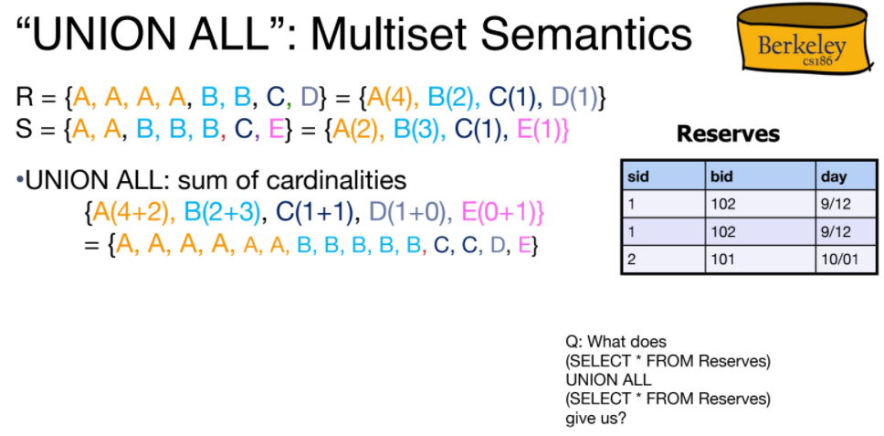 
 

- A UNION B -> perform set operation. 
- A UNION B -> Perform multi-set operation. 

## SQL Flavors 
- **Distinct**: remove duplicate rows before output. 
- **AS**: Alias name. 
- **LIKE** 'B_%' any string that starts with B, B.* any string have B. 


# File: TransactionsAndConcurrency.md

# Transactions and Concurrency
untill now we have seen seen how to deal with single query of database systems. but what if we want to execute multiple queries in a single time? and insure effeciency and relibility and avoid failures. thats where transaction manager comes in.

transaction manager has two subcomponents: 
- lock manager: handle concurrency control issues.
- Logging and Recovery: responsible for fault tolerance and recovery.

any application that needs any information from the database composed of multiple sql query generated by user behaviour, and maybe there many user trying to access the database at the same time. database has to handle those multible users and be correct.

## Concurrency Control 
- insure correct and fast data access in presnce of concurrent work by many user. 
- gives the user illusion of working in order.

## Recovery  
- ensuring fault tolerance and recovery database must have way to deals with bugs, errors, power, media failures. 
- storage gurantese of mission critical data. 

programmer doesn't have to worry about power, media failures, bugs, errors. it's all handled by the database.


## advantages of concurrent execution 
- throughput: num of quries per second maximixe with multicore proccessors. 
- Latency: responce time per transaction. 
    - multible queries are executed in parallel instead of waiting for other quireis to be excuted.
    - one query latency need to be not dependent on the other queries.
    - lightweight queries are not bottellnecked on more time-consuming quires. 


## Problems with concurrent execution 
- **incosistent read**: if user update one table and then update other table. ruser2 access table which not updated yet then table 1 which is updated. 
- **Lost Updates**: two users trying to update the same table user one finishs update before user2. then user2 update done it will overwrite the changes of user 1 and be losted.
- **Dirty Read**: user reads updates that was never committed. user 1 update not completed and aborted by the dbms. user 2 reads the data before roll back.


## Transactions 
a sequnce of multible actions read/write that to be excuted as an atomic unit. either all actions are executed or none of them are executed.
e.g transfer money from one account to another. 
reading account 
updateing account 
writing to account

in SQL
- begin transaction
- execute queries
- commit transaction

Transaction is an abstract view of an application program(activity). a sequence of read and writes of database objects. 
batch of work that be commited or aboted. 
progarm logic is invisible to the database. all it sees is the read/write ops.

# ACID


## Atomicity
- all or nothing property, all the actions should be occure or none of them should be. 

## Consistency
- if the DB starts out consistent, its ends up consistent.  
- consistency id defined by the DBMS integrity constraints.
- there is two types of consitency: 
    - consitency in data(in normalized as in pics and pics likes the nums of likes in pics likes columns is equal the nums of row in pics likes table) + referential integrity if I delete a pic row from pics table all of the sudden rows in pics likes must be deleted. 
    - consitency in reads mean if I updated a recored subsequent reads must reflect this update.
## Eventual Consitency
## Isolation
- excution of each transaction is isolated from other transactions.
- dbms **interleave** actions of many transactions. and ensures that two transactions are not **interfere**.
- final result must be idntical of the result of serial execution.
## Durability
- if transaction is commited, its state is persisted. 

A transaction ends in one of two ways: 
- commit: all the actions are executed. changes needs to be reflected in the database.
-  abort: system crash while Txn is running. no changes are made to the database. 

- Two key properties for a transaction
    - Atomicity: Either execute all its actions (committed), or none of them (aborted)
    - Durability: The effects of a committed txn must survive failures.
- DBMS typically ensures the above by logging all actions:
    - Undo the actions of aborted/failed transactions.
    - Redo actions of committed transactions not yet propagated to disk when system crashes


## ACID By Practical examples: 
- say we hav a sales and products table 
```sql 
CREATE TABLE Products ( 
    pid serial primary key, 
    name text, 
    price float, 
    inventory Integer
)

insert into Products (1, "Phone", 999.99, 100); 

CREATE Table Sales ( 
    saleId serial primary key, 
    pid Integer, 
    price float, 
    quantity Integer
)

-- if you make a sale you have to update the two tables and you can not make that in two transaction
-- you should make it in atomic transaction, 
BEGIN TRANSACTION 

UPDATE Products set inventory = inventory - 10; 
-- if the database crashed here it will be there nothing to persite it will rollback **ATOMIC** 
Insert into sales (1, 1, 999.99, 10); 
-- to deducte the product table you should insert a row in the sales tabel to reflect **CONSISTENCY** 
-- while you have not commited yet any transaction will try to read it will get the old state **ISOLATION**
-- once it commit it will reflect those changes to the disk and for subsequent TXNs. 

-- if there is two TXNs run at the same time one create report and another insert after the report it will occur inconsitency if the other TXN tried to view the dbs after this insert because THE default isolation level of PG is read commited. 
-- we solve it by run the txn in repeatable read mode that will gurantee it will give me the same view as the start of TXN. it have not seen updates yet. 

BEGIN TRANSACTION isolation level repeatable read
```

### Phantom Read
- is one of the three phenomena that happen when two isolated transaction one inserted a row and the other one start see this row and you should not see this row.
- to get rid of this using isolation levels:
    -  serializable level allow db to make serializable TXN, if PG detect dependency betwenn two TXn it will isolate those changes.
    - PG prevent Phantom read in non repeatable read also. repeatabel read gurantee you will get same result while execute same query. this not happen in MySQL. 

### serializable and Repeatable read

### Eventual Consistency


## Concurrency Control

#### Transaction schedule 
- a sequence of actions on data from one or more transactions. 
- serial schedule: each transaction run from start to end without interfering with other transactions.
- serilaizable: if involves the same Txn, each Txn ordered the same, leave the db at in the same final state.  

## conflicting operations
1. The operations are from different transactions
2. Both operations operate on the same resource
3. At least one operation is a write. 


## locking
locking ensures isolation. it ensures that dbms is able to interleave transactions while guaranteeing isolation. 

locking is what allow transaction to read or write to the same resource. transaction that read data from resource**A**, need to ensure that the data in **A** is not changed by other transaction.  

So a transaction that wants to read data will ask for a Shared (S) lock on the appropriate resource, and a transaction that wants to write data will ask for an Exclusive (X) lock on the appropriate resource.  

only one transaction can have a (X) lock on a resource. but many transactions can have a (S) lock on a resource.

## Two Phase Locking
Transactions must obtain a S (shared) lock before reading, and an X (exclusive) lock beforewriting.

Transactions  cannot  get  new  locks  after  releasing  any  locks  –  this  is  the  key  to  enforcing serializability through locking! 

### Strict two phase locking 
- ensure that all locks are released together when a transaction is completed, preventing cascading aborts.


## Lock Manager
- granted set: names of resources beaing locked. the transcaction that has the lock on the resource.
- mode: locke type.
- wait queue: list of requests that are waiting for the lock that conflict with the locks that have already been granted.


When a lock request arrives, the Lock Manager checks if any Xact in the Granted Set or in theWait Queue want a conflicting lock.  If so, the requester gets put into the Wait Queue.  If not, thenthe requester is granted the lock and put into the Granted Set.

In addition, Xacts can request a lock upgrade:  this is when a Xact with shared lock can request toupgrade to exclusive.  The Lock Manager will add this upgrade request at the front of the queue.
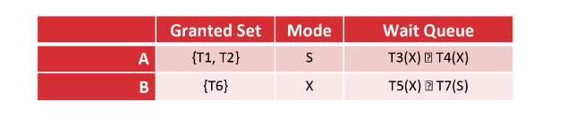 


## Deadlock

We now have a lock manager that will put requesters into the Wait Queue if there are conflicting locks.  But what happens if T1 and T2 both holdSlocks on a resource and they both try upgradetoX? T1 will wait for T2 to release the S lock so that it can get an Xlock while T2 will wait for T1 to release theSit can get an Xlock.  

At this point, neither transaction will be able to get the Xlock because they’re waiting on each other!  This is called adeadlock, a cycle of Xacts waitingfor locks to be released by each other.

### Deadlock avoidance
assign a priority to each transaction by age now - start time. if Ti want an lock that Tj have, there will be two options: 

```ruby 
Ti > Tj ? Ti waits for Tj : Tj aborts 
Ti > Tj ? Ti aborts : Tj waits for Ti 
``` 
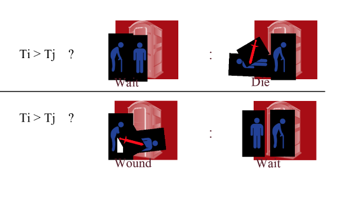 

### Deadlock detection 

We can instead try detecting deadlocks and then if we find a deadlock, we abort one of the transactions in the deadlock so the other transactions can continue. 

We will periodically check for cycles in a graph which indicates a deadlock.  If a cycle is found - wewill ”shoot” a Xact in the cycle.

- edge from Ti to Tj is a deadlock if Ti and Tj have a conflict lock on the same resource. 
- in figure T1 try to a lock on B. when T2 have conflicting lock on B.
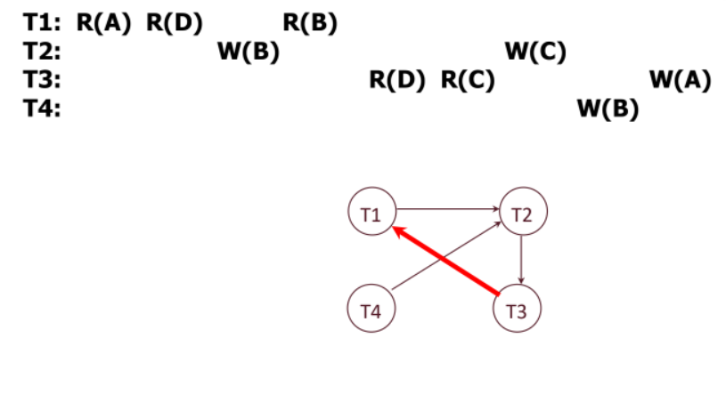 

## Lock Granularity
concerns about granularity of locks. what actullay lock. tuples, rows, columns, or entire tables. or maybe even entire databases. 

Remember  that  when  we  place  a  lock  on  a  node,  we  implicitly  lock  all  of  its  children  as  well. it allows us to place locks at different levels ofthe tree. 

- fine granularity: locks lower on tree allow higher concurrency, lots of locks(overhead). 
- coarse granularity: locks higher on tree allow lower concurrency, few locks(no overhead).

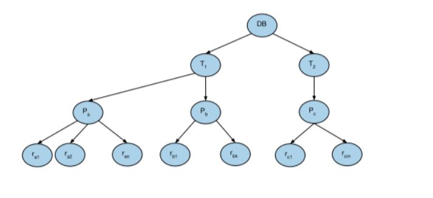


