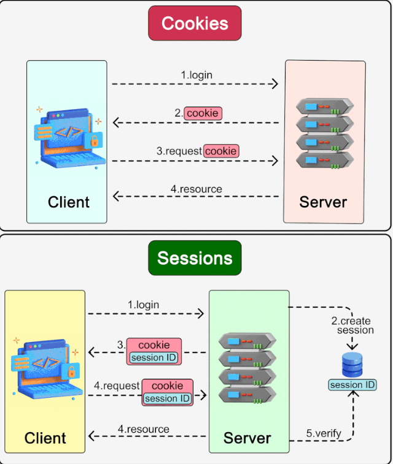

## JWT
JWT is an open standard defined in RFC 75191. It allows the secure
exchange of tokens between several parties. - Wikipedia 

**JWT token is composed of three parts:**
- a **header** structured in JSON contains, for example, the validity date
of the token.
- a **payload** structured in JSON can contain any data. In our case, it
will contain the identifier of the "connected" user.
- A **signature** allows us to verify that our application has encrypted
the token and is therefore valid.

These three parts are each encoded in ``base64`` and then concatenated
using points (.).

#### Authentication Processes
- the client request a session resource with credential's. 
- the server return the user resource along with auth token. 
- the client send the auth token for each page that require auth. 

### JWT in Rails
- add user with email and password digest attributes
- add ``Bcrypt`` gem
- include ``has_secure_password`` in the user model
    - it add a ``password`` and ``password_confirmation`` attributes to the model. 
    - when create user it hash the password and set it in ``password_digest`` 
- add the ``jwt`` gem 
    - it has two methods ``JWT.encode(message, key)`` and ``JWT.decode(decodeed_message, key)`` 

- create a JsonWebToken class under lib folder 
```ruby  
# /lib/JswonWebToken.rb
class JsonWebToken 
    # the secrete key configured in rails
    KEY_SECRETE= Rails.application.credentials.secrete_key_base.to_s
    def self.encode(payload, exp=24.hours.from_now)
        payload[:exp] = exp.to_i
        JWT.encode(payload, KEY_SECRETE)
    end 


    def self.decode(token) 
        # return the payload only
        decoded = JWT.decode(token, KEY_SECRETE).first  
        # retrive the value of hash with string or symbol
        HashWithIndifferentAccess.new decoded
    end 

end  

# /config/application.config
# load the file into our application
config.eager_load_paths << Rails.root.join('lib')
```
- then we should have a controller class to manage the creation and retriveing the token we genetrate. 

```ruby 
#app/controller/api/v1/tokens_controller.rb
class TokensController < ApplicationController

    def create 
        # find the user using email 
        @user = User.find_by_email(user_params[:email]) 
        # if the user is presented and the hashed password of the password we get from param match with the password_digest we store in the database 
        # the authenticate method provided with bcrypt do the matching part
        if @user.&authenticate(user_params[:password]) 
            render json: { 
                token: JsonWebToken.encode(user_id: @user.id), 
                email: @user.email
            }
        else 
            head :unauthorized
        end 

    end 

    private 

    def user_params
        params.require(:user).permit(:email, :password)
    end 
end  

# /config/route.rb

Rails.application.routes.draw do
    namespace :api, defaults: { format: :json } do
        namespace :v1 do
            # ...
            resources :tokens, only: [:create]
        end
    end
end 
```

- until this part we can GET an authentication token if the provided credentials are correct. 
- now we need to find the user that corresponding to a auth token given into the http header. 
- we will create a ``current_user`` method that will find the user that makes the request given auth token. 

```ruby 
#/app/controllers/concerns/authenticable.rb
module Authenticable 

    def current_user 
        return @current_user if @current_user 

        header = request.header['Authorization'] 
        return nil if header.nil?

        decoded = JsonWebToken.decode(header) 
        @current_user = User.find(decoded[:user_id]) rescue ActiveRecord::RecordNotFound
    end 

end 
``` 

- include authenticable in application controller

```ruby 
class ApplicationController < ActionController::API
    include Authenticable
end 

``` 

- implementing logging in to prevent unauthorized access.  
- will add the ``check_owner`` method that will check that the user corresponding to jwt is the same as the user who needs to be updated.

```ruby 
class UserController < ApplicationController 
    #... 

    before_action :check_owner 

    #... 

    private 
    def check_owner 
        head :forbidden if @user.id != current_user.&id
    end 


end

```


# Token based Vs Session based Auth 

[Token Vs Session]([difference between token-based and session based](https://www.educative.io/answers/session-based-authentication-vs-token-based-authentication)) 


## Sessions Vs Cookies 
  
Cookies and sessions are both used to carry user information over HTTP requests, including user login status, user permissions, etc.  
  
🔹 Cookies  
Cookies typically have size limits (4KB). They carry small pieces of information and are stored on the users’ devices. Cookies are sent with each subsequent user request. Users can choose to ban cookies in their browsers.  
  
🔹 Sessions  
Unlike cookies, sessions are created and stored on the server side. There is usually a unique session ID generated on the server, which is attached to a specific user session. This session ID is returned to the client side in a cookie. Sessions can hold larger amounts of data. Since the session data is not directly accessed by the client, the session offers more security. 

 


# OAuth 

### Resources 
[OAuth Okta](https://developer.okta.com/blog/2017/06/21/what-the-heck-is-oauth) 

## What is OAuth   

<b>
It's an open slandered for authorization. OAuth is a standard that apps can use to provide client applications with “secure delegated access”. OAuth works over HTTPS and authorizes devices, APIs, servers, and applications with access tokens rather than credentials.
</b>

# Why OAuth  

OAuth was created as a response to the direct authentication pattern. This pattern was made famous by HTTP Basic Authentication, where the user is prompted for a username and password.  
instead of sending a username and password to the server with each request, the user sends an API key ID and secret.
  
**Single-Sign On:** the user talk to their identity provider and the identity provider response with crypto token which hands off to the app to Authenticate the user.

  


  
  

# OAuth and APIs

most developers have moved to REST and stateless APIs. REST is, in a nutshell, HTTP commands pushing JSON packets over the network.

in the old days you would requested to enter username/password directory and the app would login directly as you. This gave rise to the **delegated authorization problem**.


this can be achieved using OAuth.

OAuth is a delegated authorization framework for REST/APIs. It enables apps to obtain limited access (scopes) to a user’s data without giving away a user’s password.

  you need to to do an authentication process at the front desk to get it. After authenticating and obtaining the key card, you can access resources across the hotel.

  

## OAuthing Process

- App requests authorization from User

- User authorizes App and delivers proof

- App presents proof of authorization to server to get a Token

- Token is restricted to only access what the User authorized for the specific App

# OAuth Component

- Scopes and Consent

- Actors

- Clients

- Tokens  

- Authorization server

- Flow


# Scope

the resource that you asked to accept peremission upon it. They’re bundles of permissions asked for by the client when requesting a token. and developed by the application developer.

You have to capture this consent. This is called trusting on first use, The consent can vary based on the application.

One thing to watch for when you consent is that the app can do stuff on your behalf.

You often have the ability to log in to a dashboard to see what applications you’ve given access to and to revoke consent.

  
# OAuth Actors

- **Resource Owner:** the person who owns the data on the server

- **Resource Server:** the server that holds data the application want to access.  

- **Client:** the application wants access.

- **Authorization Server:** the main engine of Auth.

  


  
  

# OAuth Tokens

## Access Tokens  

tokens the client use to access the resources server, they'r meant to be short lived. they can not be revoked.  

## Refresh Tokens

This can be used to get new access token, this require confidential clients with authentication, they can be revoked.

  
<b>

tokens are retrived from endpoints on the authorization server.

</b>

Each time you refresh your access token you get a new cryptographically signed token. Key rotation is built into the system.

  

OAuth spec does'nt define the type of token. but usually it is a **JWT json web tokens**

  

# JWT

is a secure trustworthy standard for token authentications. it allows to sign information with a signature that can be verified later with a secret signing key.

# Authorization flow

- go to authorize endpoint to get consnet and authorization from the user and

- this return authorization grant that says the user has consented to it

- the authorization grant is passed to the token endpoint

- token endpoint process the authorization grant and says here is your refresh token and access token.

- you can access the api then with the aut token, one it expire you can go back to the auth endpoint with refresh token to get new acess token.

  


  
# Pitfall for developer  

you have to manage the refresh tokens. you get the benefits of key rotations but the pain of state managements.

  

there is platforms that help with token management.

  
# Front channel and Back Channel

  


## Front Channel

The front channel is what goes over the browser. The browser redirected the user to the authorization server, the user gave consent.
## Front Flow

- RO starts the flow to delegate acess to protected resource

- client send auth request with desired scope via browser, browser redirect to the authorize endpoint on the authoriztion server.

- authoriztion server return **consent dialog** to do access upon, you need to be authenticaed to the application.

- the auth grant is passed back to the application via browser redirect.  

  


## Rquest Responce

### Request


```

GET https://accounts.google.com/o/oauth2/auth?scope=gmail.insert gmail.send

&redirect_uri=https://app.example.com/oauth2/callback

&response_type=code&client_id=812741506391

&state=af0ifjsldkj

```

- **Scopes:** from gmail api for insert and send

- **redirect_uri:** the URL of the application that the grant will returned to.

- **responce type:** vaires the OAuth flow.

- **client_id:** from the reg process

- **state:** security flag to insure **XRFS**

### Responce

```

HTTP/1.1 302 Found

Location: https://app.example.com/oauth2/callback?

code=MsCeLvIaQm6bTrgtp7&state=af0ifjsldkj

```

- HTTP 302 Redirect  

- Location the application that the grant will returned to

- **code:** the Auth grant

- **State:** to ensure it's not forged and it's from the same source.

## Back Channel

<b>

exchange the authorization code for acess token.

</b>

- the client send access token request to the token endpoint.

- the token endpoint exchange the grant code  with access token.

- client can access the protected resources  then.


## Request


```

POST /oauth2/v3/token HTTP/1.1

Host: www.googleapis.com

Content-Type: application/x-www-form-urlencoded

  

code=MsCeLvIaQm6bTrgtp7&client_id=812741506391&client_secret={client_secret}&redirect_uri=https://app.example.com/oauth2/callback&grant_type=authorization_code

```

- **The grant type** is the extensibility part of OAuth.4
## Response

```

{

  "access_token": "2YotnFZFEjr1zCsicMWpAA",

  "token_type": "Bearer",

  "expires_in": 3600,

  "refresh_token": "tGzv3JOkF0XG5Qx2TlKWIA"

}

```

<b> You can then use access token to access portected resources. </b>  
# OAuth Flow