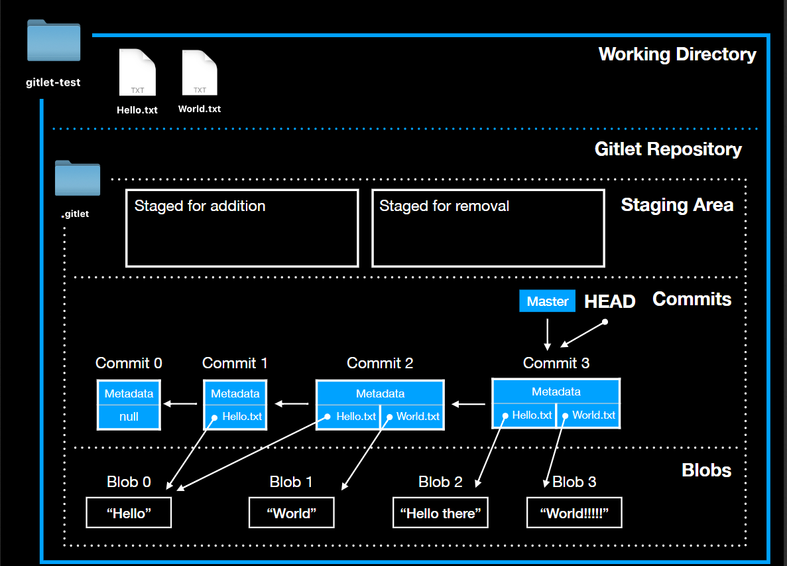

# version control systems

- Collaboration

- Tracking History

- Undoing changes  

  
# Types of Version Control Systems

## local version control system  

- Local version control systems are used to store and manage the files in a local computer.

## central version control system

- Central version control systems are used to store and manage the files in a central server.

  

## distributed version control system

- store and manage the files in a distributed server. shared among multiple computers.

  

# Why git

- Free and Open Source

- speed

- Saleable

- Distributed

- Support for non linear development

- Simple design

  

# Difference between git and other version control systems

- Snapshot Not Differences has a snapshot of every state of the project.

- Changes are stored in a log.

- Everything is local

- Integrity

- The Three Stages.

  
  

# Commits

- Commit is a snapshot of the entire project at one point in time.

- each commit contains some kind of refernce to the previous commit, this is called a parent commit. this leads to a Linked List.  

- the header pointer refers to the current commit.

- if we revert to a commit, the header pointer is set to the commit we are reverting to. leading to **detached head state** that means the head pointer does't align with the master pointer(most recent commit), **git checkout master** to back to master.

  

# Branching

- git can maintain differnt versions. **Branches**

- it'a not a linked list it's kind of a tree. called **commit tree**.

- there are two pointers representing the furthest point of each branch.

- at any given time, there is only one branch active. called **Head pointer** the pointer at the front of the current branch.

- commit trees are immutable, once the commit tree is created, it cannot be changed or destroyed. **it's add ONLY**.

- when we create a new branch, we create a new commit tree. and set the **HEAD** pointer to the new commit tree.

  

  
  
  

# Internal Structure

- **BLOB**: is a saved contents of files. Gitlet saves many versions of files, a single file might correspond to multiple blobs: each being tracked in a different commit.

- **Tree**: is a directory structure mapping names to references to blobs and other trees.

- **Commit**: combinations of

    - log messages

    - metadata(commit message, author, date)

    - references to a  tree and references to parents commits.  

    - when commit git checks if the content of file has modified or not. it is not it's clone the previous commit with the new content.

    - and move pointer (Head, master) to the new commit, the master point to the head(the most recent commit) of default branch.

- **Checkout**: is a command that allows you to switch between different versions of a file, it's simply move the **Head** pointer to a specific version/commit.

- **init**: initialize a new .git folder(repo) that kepp track of commits and stagged files.

-

  
  

  
  
  
  

# confident Git  

### Always be committing

- always be committing to avoid loosing changes, once you store your changes in git will last forever. and will have a checkpoint that i can get back to.

  

### Use stash

- git stash is a command that will grab all of the changes in the working directory and store them away.  This allows you to focus on an emergency bugfix or similar, and later revisit the code you had stashed away.

  

- the default git stash config include only the tracked files that is known for git. we can solve this using `git statsh -u` include untracked.

  

### Fails save **Reflog**

- The reflog is Git's internal record of every explicit change we've made. Any time you commit, reset, branch, merge, git record that.

  
  
  

# [Managing History](https://thoughtbot.com/upcase/videos/git-managing-history)

  

## Configuring Git commands

- `git config --global alias ."aliased_word" "command"`

## Viewing History  

- `git config --global alias.sla 'log --oneline --decorate --graph --all'`

  

## Searching History

- search into commit messages `git log -E -i --grep "word to search"`

- search into the code `git log -S function | variable | class ....

  

## finding people whom changes specific file

- git blame FileName  

## finding details of a specific commit

- `git show CommitHahs`

# [Undoing Things](https://thoughtbot.com/upcase/videos/git-undoing)

  

### Editing Commits With `Amend`  

- it can be used to edit commits if you want to edit commits messages, include files you forget, etc.

- use to include forgotten files but you need to stage those files first and it will not prompt edit window, and it will create a new commit `git commit --amend --no-edit`

- edit commit messages `git commit --amend`

  
  

### Removing files from staging area

- `git reset FileName` removing files from being commited in the next commit by unstage them.  may use `unstage` as alias for `reset`.

- git reset just remove files from staging areas.

  

- `git reset --soft HEAD^` it poping up the last commit and move backword to the previous one and keep changes as it and staged ready to commit again

### Removing files from staging area and checkout the current directory

- `git checkout .` it removes the files from staging area and change the current directory to the previous state.

  

## Resources

- ### [visualize git commands](https://git-school.github.io/visualize-git)

  

## Git Object Types

###  The Blob

the content of the files are stored as blobs. the content itself what are stored not the file that includes names and modes not stored.

### The Tree

Directories in Git basically correspond to trees. the tree has a simple list of trees and blobs that the tree contains along with names and modes of those trees and blobs.

The contents section of a tree object consists of a very simple text file that lists the mode, type, name and sha of each entry.

### The Commit

It simply points to a tree and keeps an author, **committer, message and any parent commits** that directly preceded it.

most times it will have one parent, but if you merge two branches it will point to both of them.

### The Tag

is an object that provides a permanent shorthand name for a particular commit. it contains type normally commit, and object is SHA1 of that commit, tag, tagger.

  
  
## Git Takeaways

- never rebase shared commits. do rebase on your own local work.

## Basic Git Usage

  
## git log  

- `git log --numsOfCommitsToInclude` list specified mums of commits

- `git log --oneline` print one line of info for each commit

- `git log --stat` gives statistic on each file in each commit, nums of lines added, etc

- `git log --patch` gives a complete overview of each commit.

  
  

## Commit Messages

  
## Removing Files form git

- `git rm fileName` remove file from git and working directory.

- `git rm --cached fileName` remove file from git/untrack and keep it in working tree.

- `git mv oldName newName` rename file.

  

## Git branches  

- trying to delete a branch that have unmerged work, will cause an error message, **merge** the delete. and you can not delete your current until switch to another one.

- untracked files stay in place when switching branchs,

  

### Commands

- `git branch branch name` create branch.

- `git checkout branchName` checkout to this branch.

- `git checkout -b branchName` create and checkout branch.

- `git merge branchName` merge specified branch int the current checked branch

- `git branch` list all branchs of the local repo.

- `git branch --all` list all branchs local and remote.  

- `git branch -m oldName newName` renaming branch.

- `git branch -m newName` renaming the current branch.

- `git branch -d branhcName`

  
  

## Git Rebase

- rebase looks for the base commit that is shared between two branches and rebase it on top of the other branch.

- git detached the current branch from it's base and move it on top of the target branch, no, git makes a new copies of the commit with deferent SHA1 because their parent has changed. it creates new commits with the same data but deferent hashes then move the rebased branch to the new commits.

- you can use rebase to squash several commits into one new commit.

- `git reabse branchName` rebases the current branch on top of the specified branch.

- if I have two branches and main, feature, currently I'm on the feature branch wants to rebase, I command `git rebase main` which rebase the feature branch on top of main, and then switch to main and command `git rebase feature` fast-forward the main branch.

  
  

## Git Tags

- tags create a label on a specific commit, there is two types of tags

    - `git tag tag_name` simple tags which is label to a commit and saved in `.git/refs/tags/tag_name`

    - `git tag tag_name -a -m 'message'` annotated tags it creates a tag object with additional metadata in `.git/objects` and a refs.

- `git checkout tagName` switch to a specific tag.  

-

## Git Stash

- `git stash` stashing changes from WD.

- `git stash list` list all stashes.

- `git stash show` show changes of the last stash saved.

- `git stash pop` pop up the last stash and apply it to WD.

- `git stash pop` pop up the last

  
## Undoing

- do not reset if you pushed your work to master.

- you can combine multiple commit together by `reset --mixed` and then add extra changes and commit.

- `git reset --soft` move commits from repo to stagging area.

- `git reset --mixed or just reset` move commit to the WD.

- `git reset --hard` remove changes/commits as it was not exist. it removes changes from WD too.

  

## Git Plumping

- `git cat-file -t hashcode` print type of that object.

- `git cat-file -p hashcode` pritty-print info of the tag.  

- `git show-ref branchName` show which commit this branch points to.